# 第1回: ガイダンス - Bio Media Art Workshopについて、Processingの復習

## このワークショップの目標

Bio Media Art Workshop (略称 BMAW) では、Processing および Arduino とそれらを組み合せて、センサーで環境の情報を計測したり、音や光、動きで 環境に働きかける方法を学び、植物と電子工作、プログラミングやネットワークを組み合せたバイオ・ガジェットを制作します。

作成したバイオ・ガジェットはTwitterやFacebookなどのSNSや、xivelyなどの計測データの共有サービスを利用して、積極的に世界中とシェアすることを目指します。

このワークショップでは、以下のツールやネットサービスを使用して作品を制作していきます。

### Arduino

センサーで計測した周囲の環境に関するデータを取得してMacなどのPCに送出します。デジタルとアナログの入出力ポートを備えたマイコンを搭載した専用の基板と、専用の開発環境から構成されています。

* [http://www.arduino.cc/](http://www.arduino.cc/)

### Processing

メディアアートやソフトウェアアート、ビジュアルデザインのためのプログラミング言語であり、統合開発環境。 MITメディアラボのAesthetics and Computation Group(美学と計算グループ?)に在籍していた、Casey ReasとBenjamin Fryにより2001開発されました。

* [http://processing.org/](http://processing.org/)

### Xively (旧Patchube, cosm)

センサーなどで計測したデータを、インターネットで共有するためのWebサービス。

* [https://xively.com/](https://xively.com/)


## ワークショップ全体の構成


### 月曜日:生体情報を美しくみせる(田所)

* Processing
* データの可視化、可聴化
* 生成的(Generative)表現
* ソフトウェア・アート
* ネットワークとの連携、Xively、SNS (Twitter, Facebook)


### 火曜日: 生物と人間のインタラクション(矢坂)

* Arduino 
* センサーの技術
* Touché
* Botanicus Interacticus (植物とのインタラクション)


### ワークショップで作成するシステムのイメージ

ワークショップでは、センサー、Arduino、Processingを組合せて作品を制作していきます。それぞれの役割とその接続イメージは下記の図のようになります。


### 制作する作品の例

センサーと植物をくみあわせた作品例です。Disney Researchに所属するIvan Poupyrev氏は、タッチセンサーに関する様々な研究を行っており、そこで開発された「Touché」というセンサーを用いて様々な興味深い作品を生みだしています。

Botanicus Interacticus – SIGGRAPH 2012 Exhibition, Disney Research by Ivan Poupyrev in collaboration with Philipp Schoessler, Jonas Loh/Studio NAND, and Munehiko Sato.

<!-- iframe width="640" height="360" src="http://www.youtube.com/embed/_uTJiEYI1ik" frameborder="0" allowfullscreen></iframe -->

ここで用いられているオリジナルに開発されたタッチセンサー「Touché」についての解説動画です。

<!-- iframe width="640" height="360" src="http://www.youtube.com/embed/E4tYpXVTjxA" frameborder="0" allowfullscreen></iframe -->


## Processingのスピード復習 

このワークショップでは、センサーで計測した情報の視覚化にはProcessingを使用します。そこで、まずワークショップ初回では、Processingでのプログラミングの概要について、一気におさらいしていきます。

### Processing参考書

Processingはとても素晴しいチュートリアルの書籍が多数出版されています。代表的な書籍をいくつか紹介します。

* [前川 峻志 (著), 田中 孝太郎 (著) 『Built with Processing[Ver. 1.x対応版] -デザイン/アートのためのプログラミング入門 』ビー・エヌ・エヌ新社、2010](http://www.amazon.co.jp/Built-Processing-1-x%E5%AF%BE%E5%BF%9C%E7%89%88-%E3%83%87%E3%82%B6%E3%82%A4%E3%83%B3-%E3%82%A2%E3%83%BC%E3%83%88%E3%81%AE%E3%81%9F%E3%82%81%E3%81%AE%E3%83%97%E3%83%AD%E3%82%B0%E3%83%A9%E3%83%9F%E3%83%B3%E3%82%B0%E5%85%A5%E9%96%80/dp/4861007070/ref=pd_sim_b_4)
* [Casey Reas (著), Ben Fry (著), 船田 巧 (翻訳) 『Processingをはじめよう』オライリージャパン、2011](http://www.amazon.co.jp/Processing%E3%82%92%E3%81%AF%E3%81%98%E3%82%81%E3%82%88%E3%81%86-Make-PROJECTS-Casey-Reas/dp/4873115159)
* [John Maeda, Casey Reas, Ben Fry, *Processing: A Programming Handbook for Visual Designers and Artists*, The MIT Press, 2007](http://www.amazon.co.jp/Processing-Programming-Handbook-Designers-Artists/dp/0262182629/ref=pd_sim_b_19)
* [Matt Pearson (著), 久保田 晃弘 (監修), 沖 啓介 (翻訳) 『ジェネラティブ・アート -Processingによる実践ガイド』ビー・エヌ・エヌ新社、2012](http://www.amazon.co.jp/%E3%82%B8%E3%82%A7%E3%83%8D%E3%83%A9%E3%83%86%E3%82%A3%E3%83%96%E3%83%BB%E3%82%A2%E3%83%BC%E3%83%88-Processing%E3%81%AB%E3%82%88%E3%82%8B%E5%AE%9F%E8%B7%B5%E3%82%AC%E3%82%A4%E3%83%89-Matt-Pearson/dp/4861008565/ref=pd_sim_fb_2)
* [Hartmut Bohnacker, Benedikt Gross, Julia Laub, Claudius Lazzeroni, *Generative Design: Visualize, Program, and Create with Processing*, Princeton Architectural Press, 2012](http://www.amazon.co.jp/Generative-Design-Visualize-Program-Processing/dp/1616890770/ref=pd_sim_b_10)
* [Daniel Shiffman, *The Nature of Code*, Amazon Services International, 2012](http://www.amazon.co.jp/dp/B00BPFT8D4/ref=cm_sw_r_fa_ask_hC-hF.0M2EFBJ)

### The Nature of Code


Daniel Shiffman氏の"The Nature of Code"は、Webサイトで全文公開されています(!!)、またビデオチュートリアルも公開されていてとてもわかりやすく、かつ高度なチュートリアルとなっています。基本からきちんとProcessingを学んでみたい方にお勧めです。

* [The Nature of Code オンライン版](http://natureofcode.com/book/)
* [ビデオチュートリアル (Daniel ShiffmanのVidemoアカウント)](https://vimeo.com/shiffman)

### Processing復習1: 座標、点を描く

コンピュータ画面上に図形を描いたりアニメーションをするためには、どこに図形を描くのか、つまり「場所」を指定する必要があります。プログラミングで場所を指定するには「座標」を使用します。２次元の平面では、原点からみた横の距離と縦の距離を記述することで、1点が定まります。Processingでは、ウィンドウの左上を原点(0,0)として、右方向の距離を「x座標」、下方向の位置を「y座標」と呼び、単位はピクセル(Pixel)で記述します。例えば（300, 200）という点は、画面表示領域の左上から300ピクセル右に、200ピクセル下に移動した場所になります。

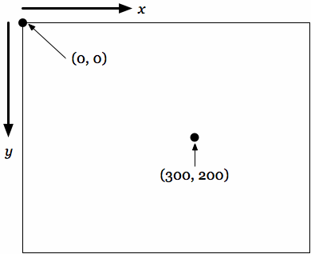

では、Processingで(300, 200)の場所に点を描いてみましょう。

```c++
size(640,480); //640x480pixelの画面を生成
point(300,200); //300x200の場所に点を描く
```

ほとんどわかりませんが、点が描かれています!

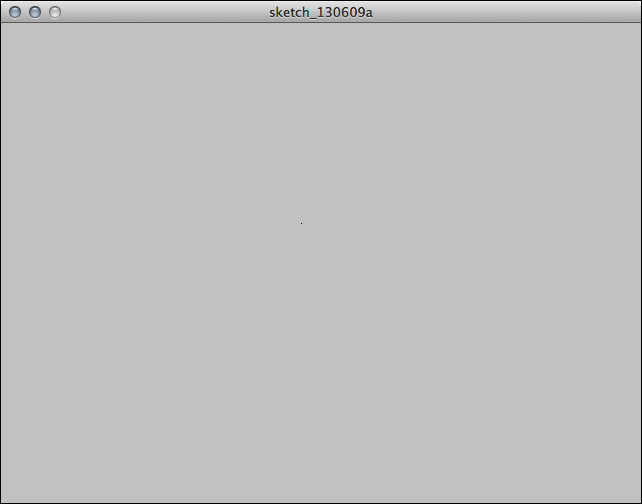

### Processing復習2: 線と基本図形

次にこのプログラムに線を追加して描いてみましょう。Processingでは、線は2つの点を結ぶ図形と考えます。

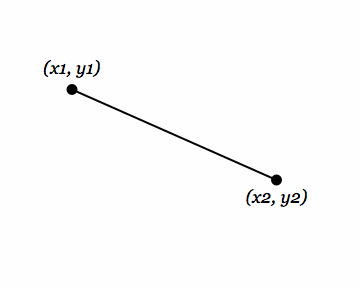


```c++
size(640,480); //640x480pixelの画面を生成
point(300,200); //(300,200)の場所に点を描く
line(50,100,400,300); //(50,100)の点から(400,300)の点へ線を引く
```

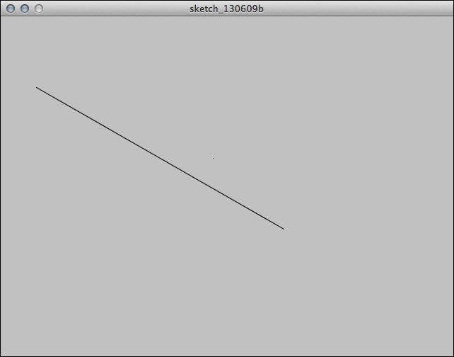

さらに四角形を描いてみます。Processingでは、四角形を描く際にはまず左上の角の座標を指定して、幅と高さを指定します。

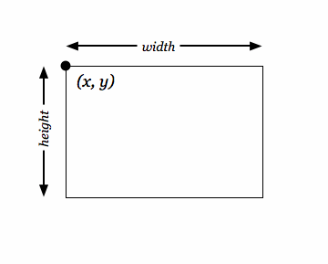

```c++
size(640,480); //640x480pixelの画面を生成
point(300,200); //(300,200)の場所に点を描く
line(50,100,400,300); //(50,100)の点から(400,300)の点へ線を引く
rect(400,100,100,300); //(400,100)の点から、幅100、高さ300の四角形を描く
```

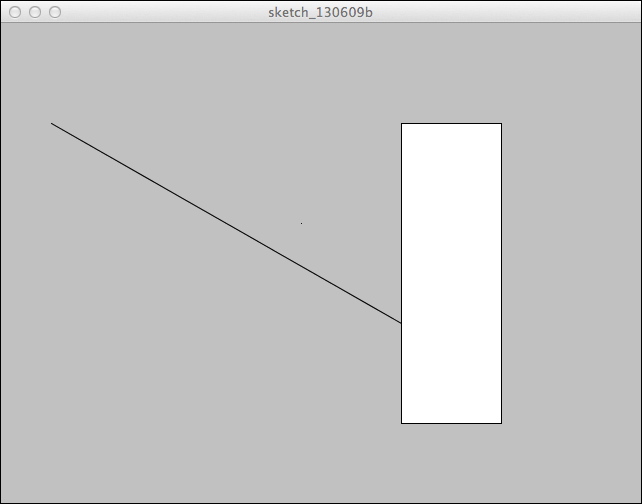

最後に円(もしくは楕円)を描いてみましょう。円や楕円は中心位置の座標と、幅と高さを指定します。

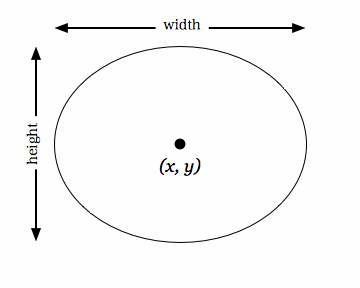

```c++
size(640,480); //640x480pixelの画面を生成
point(300,200); //(300,200)の場所に点を描く
line(50,100,400,300); //(50,100)の点から(400,300)の点へ線を引く
rect(400,100,100,300); //(400,100)の点から、幅100、高さ300の四角形を描く
ellipse(200,340,300,200); //(200,340)の点を中心に、幅300、高さ200の楕円を描く
```

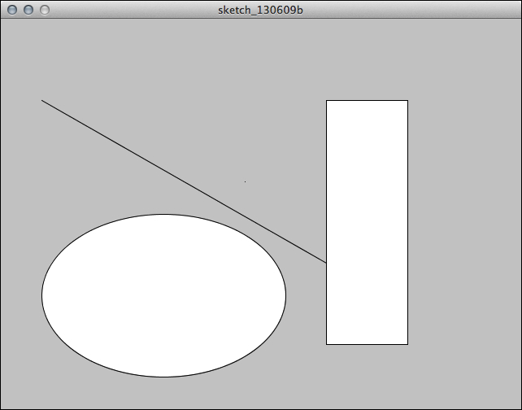


### Processing復習3: 色

次に色を指定してみましょう。現在の典型的なディスプレイでは、1つのピクセルあたり24ビットの色の情報が表現可能です。この24ビットの情報を三等分して、RGBそれぞれに8ビットずつ色の階調をわりあてています。ビットというのは、0か1かという2進数で表現される数値です。8ビットの場合であれば、2進数で00000000〜11111111の情報を扱えるということになります。これを私たちが普段馴染んでいる10進数に変換すると、0〜255になり、0を含めて256段階の階調を表現できるという意味になります。RGBそれぞれが256階調表現できることにより、その混色の結果表現できる色数は、16,777,216通り（256^3、または2^24）になります。

* 赤（R）：8bit - 00000000 〜 11111111（2進数）＝0〜255（10進数）
* 緑（G）：8bit - 00000000 〜 11111111（2進数）＝0〜255（10進数）
* 緑（B）：8bit - 00000000 〜 11111111（2進数）＝0〜255（10進数）
* 合計：24bit＝2^24＝256^3＝16,777,216

Processingにおいても、色を表現する際は、RGBの輝度の値を0〜255の範囲で指定します。その結果、コンピュータで表現できる色を最大限に引き出すことが可能となっています。

Processingで色を指定できる対象は、全部で3種類あります。背景色、塗りの色、境界線の色です。それぞれ以下のように指定します。

#### 背景色
* background(Gray);	//グレイスケール
* background(R, G, B); //RGB
* background(R, G, B, A); //RGBA (※Aは透明度)
	
#### 塗りの色
* fill(Gray);	
* fill(R, G, B);
* fill(R, G, B, A);

#### 境界線の色
* stroke(Gray);	
* stroke(R, G, B);
* stroke(R, G, B, A);

では、背景色、塗りの色、境界線の色を指定して図形を描いてみましょう。

```c++
background(15); //背景色
stroke(63,191,255); //線の色
fill(0,127,255,127); //塗りの色
size(640, 480); //640x480pixelの画面を生成
point(300, 200); //(300,200)の場所に点を描く
line(50, 100, 400, 300); //(50,100)の点から(400,300)の点へ線を引く
rect(400, 100, 100, 300); //(400,100)の点から、幅100、高さ300の四角形を描く
ellipse(200, 340, 300, 200); //(200,340)の点を中心に、幅300、高さ200の楕円を描く
```

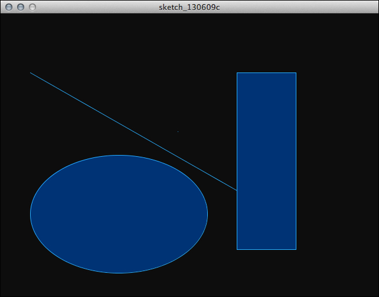


### Processing復習4: アニメーション、setup()とdraw()

Processingでアニメーションを実現するには、現在のプログラムをより構造化していく必要があります。Processingでは、setup()とupdate()という二つのパートに構造化してアニメーションを実現します。

* setup() - 初期設定: プログラムの起動時に一度だけ実行されます。画面の基本設定やフレームレートなどを設定します。
* draw() - 描画: 設定した速さ(フレームレート)でプログラムが終了するまでくりかえし実行されます。


この仕組みを利用して、円が斜め下に移動するプログラムを作成してみましょう。

```c++
float posX, posY; //円の中心位置を格納する変数
float speedX, speedY; //円の速度を格納する変数
void setup() {
  size(640, 480); //640x480pixelの画面を生成
  frameRate(60); //フレームレート
  stroke(63, 191, 255); //線の色
  fill(0, 127, 255, 127); //塗りの色
  posX = 40; //円の初期位置X
  posY = 40; //円の初期位置Y
  speedX = 3; //円の初期位置X
  speedY = 2; //円の初期位置Y
}

void draw() {
  background(15); //背景を描画
  ellipse(posX, posY, 20, 20); //指定した位置に円を描画
  posX = posX + speedX; //円のX座標を更新
  posY = posY + speedY; //円のY座標を更新
}
```

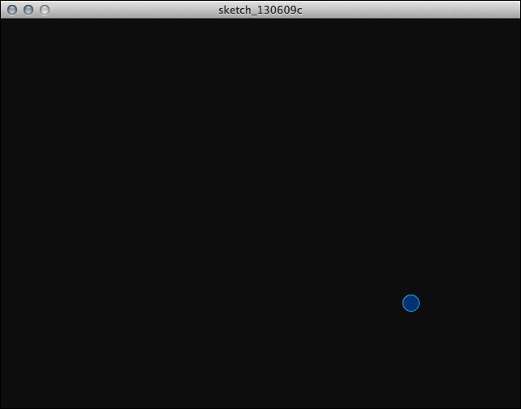


### Processing復習5: 条件分岐

では、この動きを改良して画面の端にきたらバウンドする動きを加えてみましょう。この動きを実現するには以下の条件を設定する必要があります。

* 画面の右端、もしくは画面の左端 → X方向のスピードを反転
* 画面の上端、もしくは画面の下端 → Y方向のスピードを反転

プログラミング言語で、このような「もし○○だったら、□□しなさい、（そうでなければ、△△△しなさい）」というような制御構造を表現するための仕組みとして、「if文」というものがあります。if文は、処理の条件となる条件式、条件に合致する倍に処理される真文、条件に合わない場合に処理される偽文から構成されています。

Processingで条件式を記述するには下記の書式を用います。

```c++
if(《条件式》){
	《真文》
} else {
	《偽文》
}
```

偽文（そうでなければ、△△△しなさい）の部分が必要なければ、省略して

```c++
if(《条件式》){
	《真文》
}
```

と書くことも可能です。この条件分岐を適用して画面の端にきたらX方向もしくはY方向のスピードを反転させます。

```c++
float posX, posY; //円の中心位置を格納する変数
float speedX, speedY; //円の速度を格納する変数

void setup() {
  size(640, 480); //640x480pixelの画面を生成
  frameRate(60); //フレームレート
  stroke(63, 191, 255); //線の色
  fill(0, 127, 255, 127); //塗りの色
  posX = 40; //円の初期位置X
  posY = 40; //円の初期位置Y
  speedX = 3; //円の初期位置X
  speedY = 2; //円の初期位置Y
}

void draw() {
  background(15); //背景を描画
  ellipse(posX, posY, 20, 20); //指定した位置に円を描画
  posX = posX + speedX; //円のX座標を更新
  posY = posY + speedY; //円のY座標を更新
  if (posX < 0 || posX > width) { //もし画面の左端、または右端に到達したら
	speedX = speedX * -1; //X方向のスピードを反転
  }
  if (posY < 0 || posY > height) { //もし画面の下端、または上端に到達したら
	speedY = speedY * -1; //Y方向のスピードを反転
  }
}
```

このプログラムを実行すると、画面の端でバウンドする動きになります。


### Processing復習6: ベクトル(向きと大きさ)で動きを再定義

ここまでの動きの定義の方法は、あまり洗練されたやり方とはいえませんでした。２次元平面での動きを定義するのに以下のような変数を使用しています。

* 位置: posX と posY
* 速度: speedX と speedY

今後、より高度なアニメーションを実現するために、例えば以下のような様々な変数が必要となってきます。

* 加速度: X方向の加速度、Y方向の加速度
* 到達地点: X座標、Y座標
* 摩擦: X方向の摩擦、Y方向の摩擦
…etc.

それぞれのパラメーターで、常に(x, y)という2つの変数を必要としています。これをより整理して定義できないものでしょうか。例えば、現在のコードの以下の部分。

```c++
float posX, posY;
float speedX, speedY;
```

これを

```c++
Vector location;
Vector speed;
```

のようにベクトルを使用して定義できると、プログラムはとても整理されたものとなります。

ベクトルとは、幾何学的空間における、大きさと向きを持った量を意味します。例えば、速度や加速度、力は全てベクトルです。平面上や空間内の矢印としてイメージすると良いでしょう。

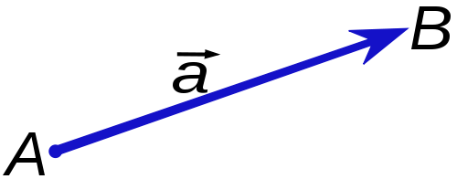


例えば、原点(0,0)から(2,3)の座標までのベクトルがあったとします。

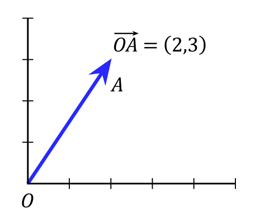

このベクトル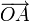は、以下のように記述されます。

	a = (2,3)
	
ベクトルは足し算することが可能です。例えば、以下の2つのベクトルがあったとします。

	a = (-2,3)
	b = (4,2)
	
このとき、aとbのベクトルを足し合わせると以下のようになります。

	a + b = (-2+4,3+2) = (2,5)
	
これは、以下の図をイメージするとわかりやすいでしょう。


同様にベクトルの引き算も可能です。

	a - b = (-2-4,3-2) = (-6,1)
	
	
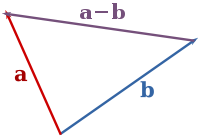


Processingでは、このような座標での位置や速度を定義するのに適した「PVector」というクラス(属性と動作の型)が用意されています。今回のような２次元平面でのアニメーションも、PVectorクラスを用いることでとても簡単に整理されます。先程の画面の端でバウンドするアニメーションを、PVectorを使用して書き直してみましょう。

```c++
PVector location; //位置のベクトル
PVector velocity; //速度のベクトル

void setup() {
  size(640, 480); //640x480pixelの画面を生成
  frameRate(60); //フレームレート
  stroke(63, 191, 255); //線の色
  fill(0, 127, 255, 127); //塗りの色
  location = new PVector(40, 40); //位置のベクトルの初期設定
  velocity = new PVector(3, 2); //速度のベクトルの初期設定
}

void draw() {
  background(15); //背景を描画
  ellipse(location.x, location.y, 20, 20); //指定した位置に円を描画
  location.add(velocity); //位置のベクトルに速度のベクトルを加算、次の位置になる
  if ((location.x > width) || (location.x < 0)) { //もし画面の左端、または右端に到達したら
    velocity.x *= -1; //X方向のスピードを反転
  }
  if ((location.y > height) || (location.y < 0)) { //もし画面の下端、または上端に到達したら
    velocity.y *= -1; //Y方向のスピードを反転
  }
}
```

とてもプログラムがすっきり整理されたものになりました。

### Processing復習7: 繰り返しによる増殖


