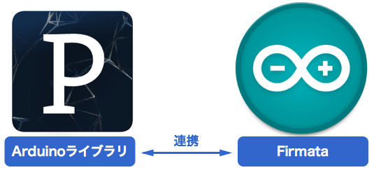
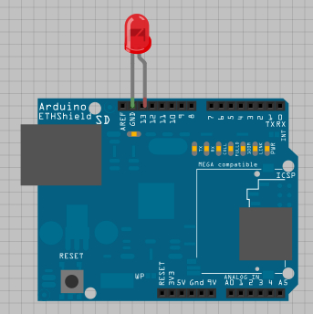
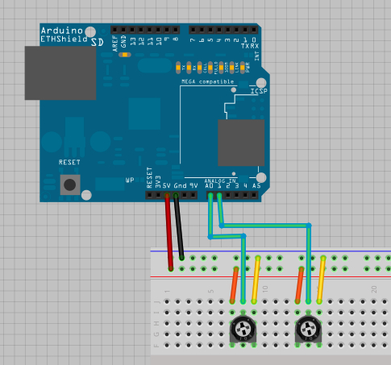
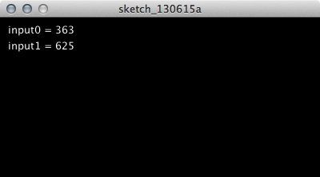
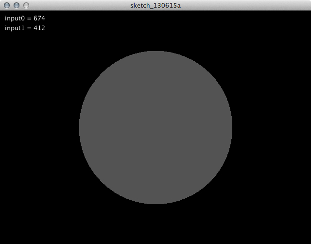

# 第2回: ProcessingとArduinoを接続する

今回は、いよいよProcessingとArduinoを連携する方法について実際にプログラミングしながら学んでいきます。ProcessingとArduinoを連携する方法は大きく分けて2つのやり方があります。

### 1. 既存のライブラリを使用する方法

Arduino側にFirmataライブラリ、Processing側にArduinoライブラリをインストールして、Processingから直接Arduinoの入出力を操作する方法。

### 2. シリアル通信を自作する方法

外部ライブラリは使用せず、ArduinoとProcessing双方で、シリアル入出力のプログラミングを行う方法。

今回はこの2つの方法の双方を紹介していきます。

## 連携方法 1: ArduinoライブラリとFirmataを使用する方法

**注意!!: Processing 2.0は、Arduinoライブラリ+Firmataの環境に対応していません。この方法を試す場合には、Processing 1.5.1を使用してください。インストールは下記のリンクから、v1.5.1を選択してダウンロードしてください。 **

* [https://processing.org/download/?processing](https://processing.org/download/?processing)

Arduino側にFirmataライブラリ、Processing側にArduinoライブラリをインストールして、Processingから直接Arduinoの入出力を操作する方法です。この方法を図にすると以下のようなイメージとなるでしょう。

### Arduino側の準備: Firmataライブラリをインストール

では、まずArduino側から準備を始めましょう。

ArduinoにはFirmataと呼ばれる、ArduinoなどのマイコンとPCとのコミュニケーションのための汎用のプロトコルを使用します。そのために、ArduinoにFirmataのためのプログラムをアップロードして使用します。今回はArduinoのサンプルの中に掲載されている「Standard Firmata」というプログラムを使用していきます。

Arduinoのメニューから以下のプログラムを開きます。

* File > Examples > Firmata > StandardFirmata

### Firmataの動作確認

Firmataの動作確認には、プロジェクトページから配布されているテストプログラムを使用します。

* [Main Page - Firmata](http://firmata.org/wiki/Main_Page)

このページの「Firmata Test Program」の項目にある

* For Mac OS-X: [http://www.pjrc.com/teensy/firmata_test/firmata_test.dmg](http://www.pjrc.com/teensy/firmata_test/firmata_test.dmg)

をダウンロードします。プログラムを展開し、FirmataをアップロードしたArduinoがUSBに接続されている状態で「firmata_test.app」を起動します。

プログラムのメニューバー「Port」メニューから接続しているポートを選択すると、下記のようなテスト画面になります。Pin 2 〜 Pin 21までの入出力をGUIで操作しながら試すことが可能です。

### Processing側の準備: Arduinoライブラリのインストール

次にProcessing側の準備をしましょう。ArduinoにFirmataライブラリをインストールしたのと同様に、Processing側にはArduinoをコントロールするためのライブラリをインストールします。Arduinoライブラリは、ProcessingからArduinoをコントロールするためにデザインされたライブラリで、Arduino側にはFirmataがインストールされていれば、特に追加でコーディングする必要はありません。

まず、Arduinoライブラリをダウンロードします。下記のリンクから「Processing Library: processing-arduino.zip」を選択してダウンロードしてください。

* [http://playground.arduino.cc/interfacing/processing](http://playground.arduino.cc/interfacing/processing)

ダウンロードした「processing-arduino.zip」を展開すると、「arduino」というフォルダが生成されます。このフォルダを、「書類」フォルダ内の「Processing」>「libraries」にコピーしてください。

### Processing + Firmataをつかってみる: シリアルポートの確認

まず、ProcessingからArduinoにインストールしたFirmataを操作するには、まず使用しているシリアルポートの環境を知る必要があります。下記のコードをProcessingに入力してください。

	import processing.serial.*;
	import cc.arduino.*;
	Arduino arduino;
	
	void setup() {
	  println(Arduino.list());
	}

すると、Processingの下部のコンソールに以下のようなメッセージが表示されるはずです。

	[0] "/dev/tty.Bluetooth-PDA-Sync"
	[1] "/dev/cu.Bluetooth-PDA-Sync"
	[2] "/dev/tty.Bluetooth-Modem"
	[3] "/dev/cu.Bluetooth-Modem"
	[4] "/dev/tty.usbserial-A900ceWs"
	[5] "/dev/cu.usbserial-A900ceWs"

この中から、「/dev/tty.usbserial…」もしくは「/dev/tty.usbmodem…」から始まる記述の先頭の番号(上記の例では4番)を憶えておきます。

### Processing + Firmataをつかってみる 1: Digital OUT - LEDを点灯

では、まず簡単なプログラムで動作を確認してみましょう。Processingの画面でマウスを押すとLEDが点灯するプログラムを作成してみましょう。Arduino側は、Digital Outの13番にLEDを接続しておきます。

	import processing.serial.*;
	import cc.arduino.*;
	
	Arduino arduino;
	int ledPin = 13;
	color bgColor = color(0);
	
	void setup() {
	  size(400, 200);
	  arduino = new Arduino(this, Arduino.list()[4], 57600);
	  arduino.pinMode(ledPin, Arduino.OUTPUT);
	}
	
	void draw() {
	  background(bgColor);
	}
	
	void mousePressed() {
	  arduino.digitalWrite(ledPin, Arduino.HIGH);
	  bgColor = color(255,0,0);
	}
	
	void mouseReleased() {
	  arduino.digitalWrite(ledPin, Arduino.LOW);
	  bgColor = color(0);
	}

画面をクリックすると、LEDが点灯するはずです。

### Processing + Firmataをつかってみる 2: Analog In - センサーの情報を視覚化

では次に、アナログ入力を試してみましょう。この方法が、今後、様々なセンサーからの情報をProcessingで視覚化していく基本となります。

まずは、Arduino側のセンサーの準備をしましょう。まずはシンプルに2つの可変抵抗(もしくは光センサーなどの簡単なセンサー)を用いて実験してみましょう。例えば、下記の図は、2つの可変抵抗を接続した際の配線のサンプルとなります。

このセンサーの情報を視覚化するProcessingのコードを書いてみましょう。まずはシンプルにセンサーから取得した値の数値をモニターしてみましょう。

	import processing.serial.*;
	import cc.arduino.*;
	Arduino arduino;
	int input0 = 0;
	int input1 = 1;
	
	void setup() {
	  size(400,200);
	  arduino = new Arduino(this, Arduino.list()[4], 57600);
	  arduino.pinMode(input0, Arduino.INPUT);
	  arduino.pinMode(input1, Arduino.INPUT);
	}
	
	void draw() {
	  background(0);
	  fill(255);
	  int analog0 = arduino.analogRead(input0);
	  int analog1 = arduino.analogRead(input1);
	  text("input0 = " + analog0, 10, 20);
	  text("input1 = " + analog1, 10, 40);
	}

このコードを実行すると、Analog0とAnalog1に入力したセンサーの生の値が、文字で表示されます。センサーの値は、ほぼ0〜1023の範囲となっているでしょう。

では、この数値を利用して、簡単な視覚化を行ってみましょう。下記のサンプルは、Analog Pin 0の値を円の直径に、Analog Pin 1の値を円のグレースケールの濃度に適用しています。

	import processing.serial.*;
	import cc.arduino.*;
	Arduino arduino;
	int input0 = 0;
	int input1 = 1;
	
	void setup() {
	  size(640, 480);
	  arduino = new Arduino(this, Arduino.list()[4], 57600);
	  arduino.pinMode(input0, Arduino.INPUT);
	  arduino.pinMode(input1, Arduino.INPUT);
	}
	
	void draw() {
	  background(0);
	  fill(255);
	  int analog0 = arduino.analogRead(input0);
	  int analog1 = arduino.analogRead(input1);
	  text("input0 = " + analog0, 10, 20);
	  text("input1 = " + analog1, 10, 40);
	
	  float diameter = map(analog0, 0, 1024, 0, height);
	  float fillColor = map(analog1, 0, 1024, 0, 255);
	
	  fill(fillColor);
	  noStroke();
	  ellipse(width/2, height/2, diameter, diameter);
	}

## 連携方法 2: シリアル通信を自作する方法

## 複数のセンサーの値を送受信

## センサーの値ビジュアライズ