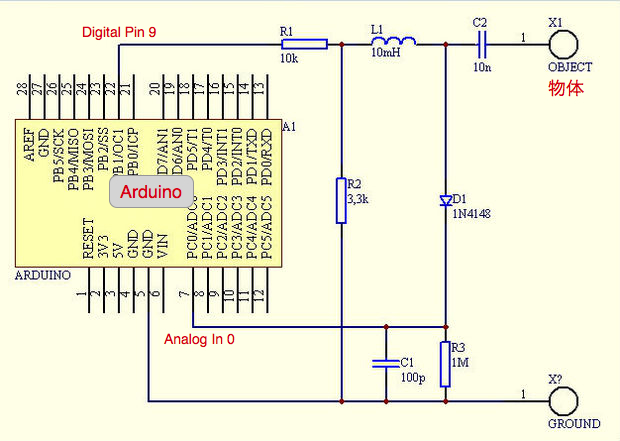
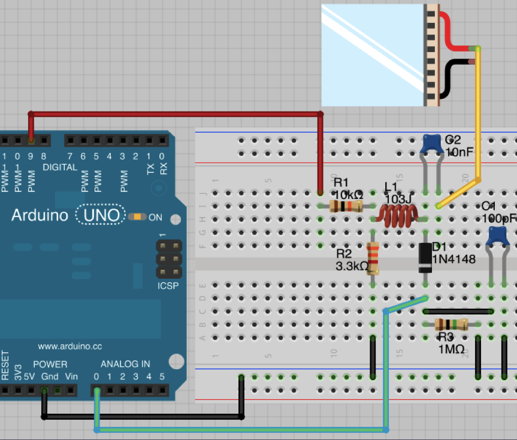
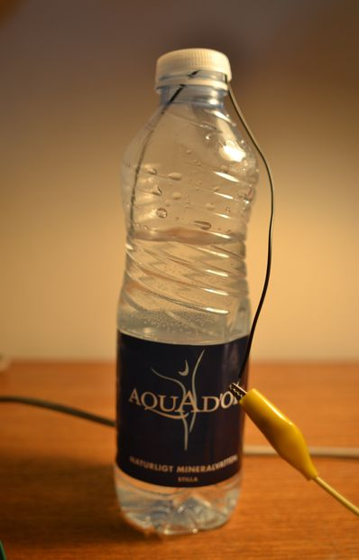
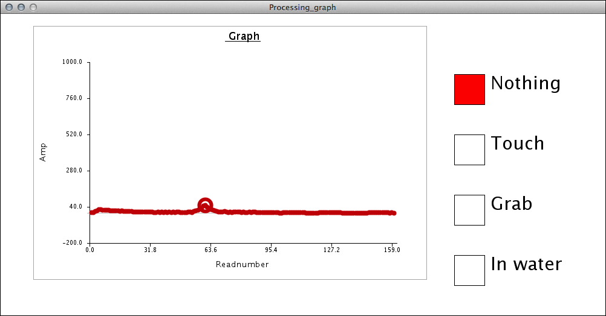
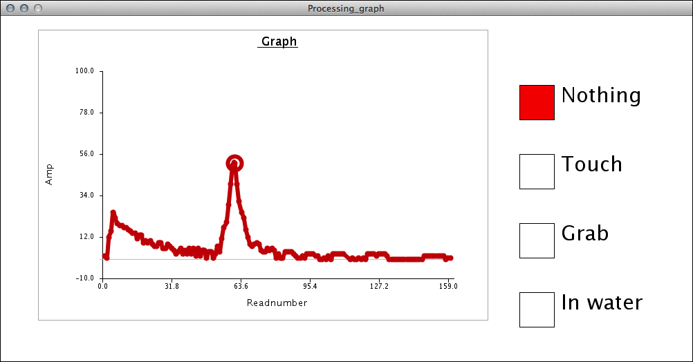

# Toucheをつかってみる

今回からは、いよいよToucheセンサーを自作してタッチ検出に挑戦します。まずは、Toucheのセンサーのハードウェアを制作します。センサーが完成したら、水を入れたコップ、金属製の製品、即物など様々な物体でタッチ検出できるか試してみましょう。後半は、ソフトウェアを解析して、表示や表現の方法を変更するにはどう改造していけば良いのか考えていきます。

## Toucheに必要な材料

ArduinoでToucheセンサーを自作するには以下の部品が必要となります。それぞれのパーツは、どれも入手は難しくないものです。今回はArduinoプロトシールドなどは使用せず、まずはブレッドボードで配線することにします。

* Arduino
* Usbケーブル(ArduinoとPCを接続)
* ブレッドボード
* 抵抗器: 10KΩ, 1MΩ, 3.3KΩ
* コンデンサー: 100pf (絶縁型ラジアルリード型積層セラミックコンデンサー100pF 50V±5%5mmなど [千石電商](http://www.sengoku.co.jp/mod/sgk_cart/detail.php?code=8BNG-TDMS)、[秋月電子通商](http://akizukidenshi.com/catalog/g/gP-03623/))
* コンデンサー: 10nf (絶縁型ラジアルリード型積層セラミックコンデンサー0.01μF 50V±10％5mmなど [秋月電子通商](http://akizukidenshi.com/catalog/g/gP-02281/))
* ダイオード: 1N4148 (汎用小信号高速スイッチング・ダイオード 1N4148 100V200mAなど [千石電商](http://www.sengoku.co.jp/mod/sgk_cart/detail.php?code=7DUC-SCL4)、[秋月電子通商](http://akizukidenshi.com/catalog/g/gI-00941/))
* インダクター: 10mH (太陽誘電 LHLC10NB 103Jインダクタ10mH 0.14Aなど [千石電商](http://www.sengoku.co.jp/mod/sgk_cart/detail.php?code=7A5C-KRDF))

## Toucheハードウェアを制作

まず、Touche for Arduinoの回路図をみてみましょう。この配線を実現するためにブレッドボードにどのようにパーツを配置して、Arduinoと結線していけば良いのか考えていきます。

この回路をブレッドボードで実現する方法はいろいろ考えられます。パズルを解くような気分で配線してみましょう。例えば先週の矢坂先生の授業では以下のような配線を紹介しました。

配線を少し簡略化した別バージョンの配線です。

これらの配線図を参考に、Toucheセンサーを自作してみましょう。

## Toucheソフトウェアをダウンロード

早速、自作したToucheセンサーを試してみましょう。ソフトウェアは前回と同様下記のGithubアカウントからダウンロードして使用します。

* [https://github.com/Illutron/AdvancedTouchSensing](https://github.com/Illutron/AdvancedTouchSensing)

## ソフトウェアの使い方

Zipファイルをダウンロードして、まず「Arduino_sensing」フォルダ内の「Arduino_sensing.ino」プログラムをArduino.appから開いてボードに書き込みます。次に「Processing_graph」フォルダ内の「Processing_graph.pde」をProcessing.appで開き、Processingを実行してみてください。

すると、下記のような画面が表示されるはずです。

このプログラムは以下のようにして使用します。

* Toucheセンサーを接続
* Arduino_sensing.inoをArduinoに転送
* Processing.appでProcessing_graph.pdeを開いて実行
* センサーで計測された値がグラフで表示される(はず)
* ジェスチャーをして、右側のボタンで登録(全部で4種類まで可能)
* 同じジェスチャーを再現
* 右側のボタンで該当するものが点灯する(はず)

## 様々な物体でのタッチ検出に挑戦!

次にタッチを検出する物体を用意しましょう。まずは、水を入れたペットボトルで実験してみます。容器に水を溜めて、水の中にセンサー用のワイヤーを垂らします。

物体とTouchセンサーを接続したら、Processing側のアプリProcessing_graph.pdeを起動します。

もし下記のようにグラフの反応が少ない場合は、グラフの最大値と最小値を調整します。

Processing_graph.pdeの、draw()関数内、「Print the graph」というコメントのすぐ下にある、下記のコードを調整します。

    MyArduinoGraph.yMax=1000;      
    MyArduinoGraph.yMin=-200;
    
デフォルトの状態では、最大値1000、最小値-200なので、例えばこれを最大値200、最小値-10にするのであれば、

    MyArduinoGraph.yMax=100;      
    MyArduinoGraph.yMin=-10;
    
とします。すると、表示が拡大され、はっきりとグラフの曲線が観察できます。

水を入れたペットボトルがうまくいったら、様々な物体でタッチ検出ができるか試してみましょう。例えば、水耕栽培している植物にタッチセンサーを入れてみました。

    

## Toucheプログラムを解析する

今後はこのToucheのプログラムを利用して、作品を制作していきます。まず始めにこのToucheのProcessigのプログラムは何をしているのか、実際にソースを解析しながら理解していきましょう。

	Graph MyArduinoGraph = new Graph(150, 80, 500, 300, color (200, 20, 20));
	float[] gestureOne=null;
	float[] gestureTwo = null;
	float[] gestureThree = null;
	
	float[][] gesturePoints = new float[4][2];
	float[] gestureDist = new float[4];
	String[] names = {
	  "Nothing", "Touch", "Grab", "In water"
	};
	void setup() {
	
	  size(1000, 500); 
	
	  MyArduinoGraph.xLabel="Readnumber";
	  MyArduinoGraph.yLabel="Amp";
	  MyArduinoGraph.Title=" Graph";  
	  noLoop();
	  PortSelected=4;      
	  /* ====================================================================
	   adjust this (0,1,2...) until the correct port is selected 
	   In my case 2 for COM4, after I look at the Serial.list() string 
	   println( Serial.list() );
	   [0] "COM1"  
	   [1] "COM2" 
	   [2] "COM4"
	   ==================================================================== */
	  SerialPortSetup();      // speed of 115200 bps etc.
	}
	
	
	void draw() {
	  background(255);
	
	  /* ====================================================================
	   Print the graph
	   ====================================================================  */
	
	  if ( DataRecieved3 ) {
	    pushMatrix();
	    pushStyle();
	    MyArduinoGraph.yMax=100;      
	    MyArduinoGraph.yMin=-10;      
	    MyArduinoGraph.xMax=int (max(Time3));
	    MyArduinoGraph.DrawAxis();    
	    MyArduinoGraph.smoothLine(Time3, Voltage3);
	    popStyle();
	    popMatrix();
	
	    float gestureOneDiff =0;
	    float gestureTwoDiff =0;
	    float gestureThreeDiff =0;
	
	    /* ====================================================================
	     Gesture compare
	     ====================================================================  */
	    float totalDist = 0;
	    int currentMax = 0;
	    float currentMaxValue = -1;
	    for (int i = 0; i < 4;i++){
	
	      //  gesturePoints[i][0] = 
	      if (mousePressed && mouseX > 750 && mouseX<800 && mouseY > 100*(i+1) && mouseY < 100*(i+1) + 50){
	        fill(255, 0, 0);
	
	        gesturePoints[i][0] = Time3[MyArduinoGraph.maxI];
	        gesturePoints[i][1] = Voltage3[MyArduinoGraph.maxI];
	      } else {
	        fill(255, 255, 255);
	      }
	
	      //calucalte individual dist
	      gestureDist[i] = dist(Time3[MyArduinoGraph.maxI], Voltage3[MyArduinoGraph.maxI], gesturePoints[i][0], gesturePoints[i][1]);
	      totalDist = totalDist + gestureDist[i];
	      if (gestureDist[i] < currentMaxValue || i == 0){
	        currentMax = i;
	        currentMaxValue =  gestureDist[i];
	      }
	    }
	    totalDist=totalDist /3;
	    for (int i = 0; i < 4;i++){
	      float currentAmmount = 0;
	      currentAmmount = 1-gestureDist[i]/totalDist;
	      if (currentMax == i){
	        fill(0, 0, 0);
	        //       text(names[i],50,450);
	        fill(currentAmmount*255.0f, 0, 0);
	      } else {
	        fill(255, 255, 255);
	      }
	      stroke(0, 0, 0);
	      rect(750, 100 * (i+1), 50, 50);
	      fill(0, 0, 0);
	      textSize(30);
	      text(names[i], 810, 100 * (i+1)+25);
	
	      fill(255, 0, 0);
	      //   rect(800,100* (i+1), max(0,currentAmmount*50),50);
	    }
	  }
	}
	
	void stop(){
	  myPort.stop();
	  super.stop();
	}
