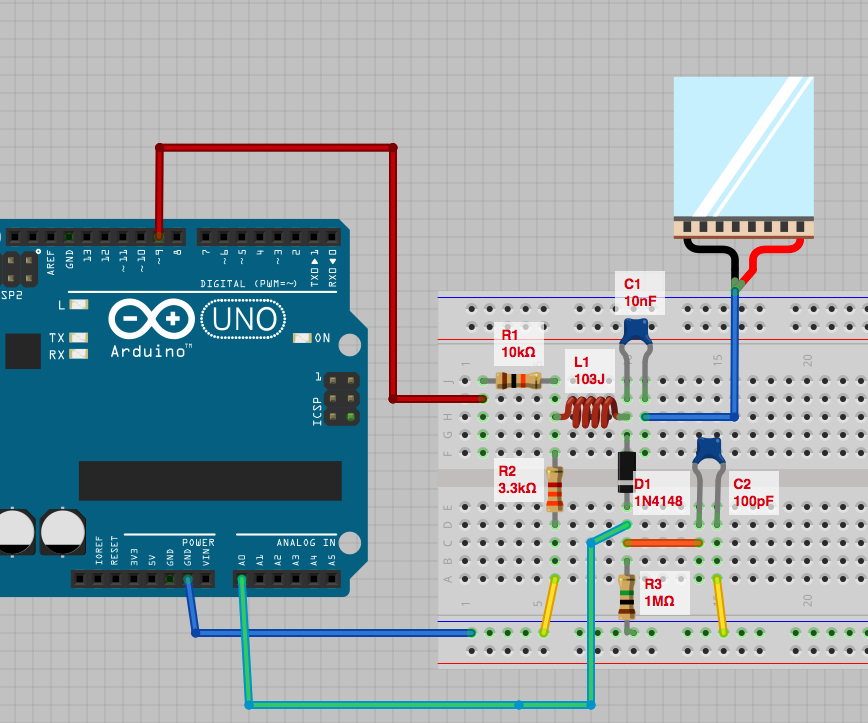
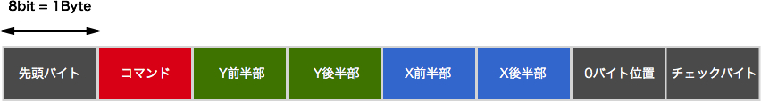
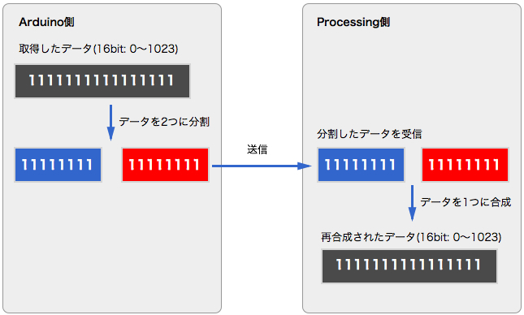
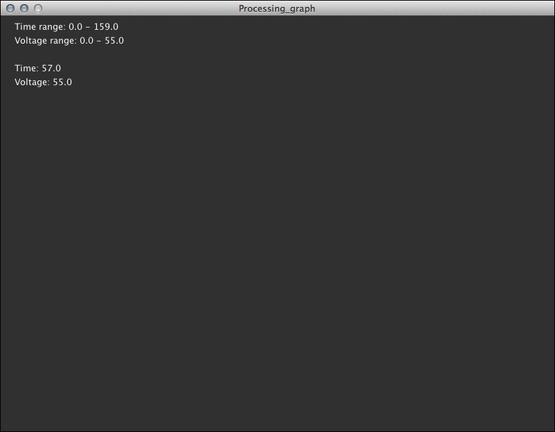
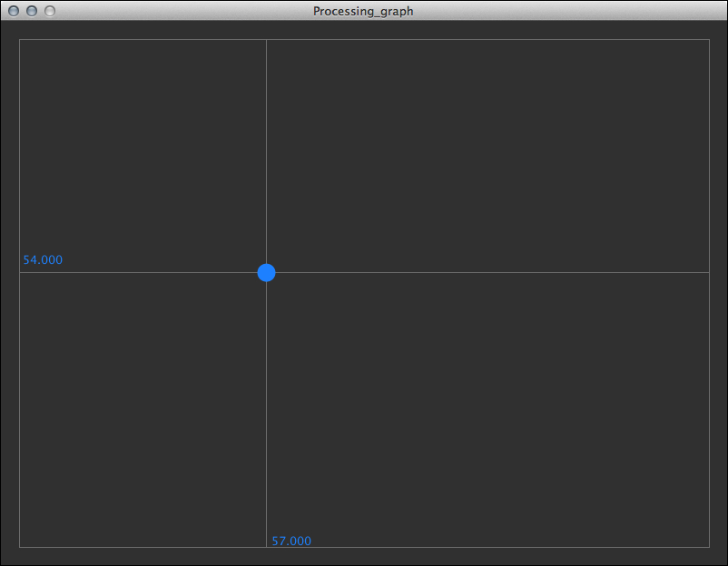
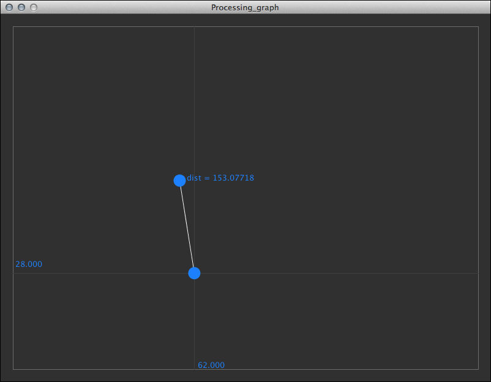
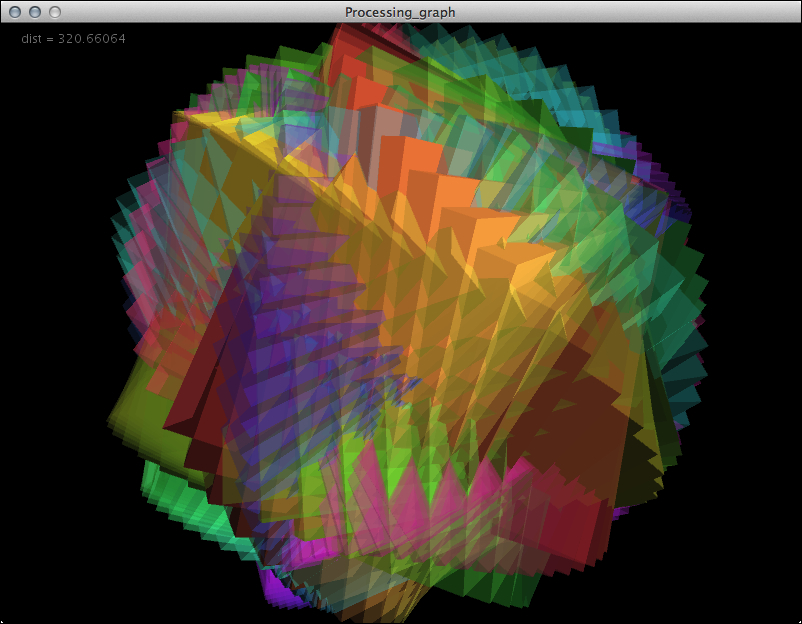

# Toucheセンサーを使う 2 - Touche for Arduinoの値をつかってProcessingで表現する

前回はTouche for Arduinoセンサーをつかって、様々なジェスチャーを検出することができました。今回はTouche for ArduinoのセンサーからProcessingにどのような値が送られてきているのか、プログラムを解析しながら明らかにしていきます。また、その値をどのように利用したら、Processingで面白い表現ができるのか考えていきましょう。

## 前回までの復習: Touche for Arduinoの作成

まずは、前回と同様、Touche for Arduinoの回路をブレッドボードに組み立てましょう。

ソフトウェアは前回と同様下記のGithubアカウントからダウンロードして使用します。

* [https://github.com/Illutron/AdvancedTouchSensing](https://github.com/Illutron/AdvancedTouchSensing)

前回はこのプログラムの中で、主にジェスチャーを判別する部分について解説しました。ポイントは、検出したグラフで電圧が最大のピークになっている部分の(x, y)座標を記録して、新たなジェスチャーと記録したジェスチャーの距離を算出しているという部分です。以下のコメント入りのソースで再度確認しましょう。

#### Processing側 - Processing_graph.pde

	/*
	 * Processing_graph.pde
	 *
	 */

	// グラフ描画のクラスのインスタンス化(初期化)
	Graph MyArduinoGraph = new Graph(150, 80, 500, 300, color (200, 20, 20));
	// 4つのジェスチャーを記録する配列
	float[][] gesturePoints = new float[4][2];
	// 現在のジェスチャーと登録したジェスチャーとの距離
	float[] gestureDist = new float[4];
	// それぞれのジェスチャーの名前の文字列
	String[] names = {
	  "Nothing", "Touch", "Grab", "In water"
	};
	
	void setup() {
	  //画面サイズ
	  size(1000, 500); 
	  // グラフのラベル設定
	  MyArduinoGraph.xLabel="Readnumber";
	  MyArduinoGraph.yLabel="Amp";
	  MyArduinoGraph.Title=" Graph";  
	  noLoop();
	
	  //ポートを設定
	  PortSelected=4; 
	
	  //シリアルポートを初期化
	  SerialPortSetup();
	}
	
	
	void draw() {
	  background(255);
	
	  /* ====================================================================
	   グラフを描画
	   ====================================================================  */
	
	   if ( DataRecieved3 ) {
		pushMatrix();
		pushStyle();
		MyArduinoGraph.yMax=100;	  
		MyArduinoGraph.yMin=-10;	  
		MyArduinoGraph.xMax=int (max(Time3));
		MyArduinoGraph.DrawAxis();	
		MyArduinoGraph.smoothLine(Time3, Voltage3);
		popStyle();
		popMatrix();
	
		float gestureOneDiff =0;
		float gestureTwoDiff =0;
		float gestureThreeDiff =0;
	
		/* ====================================================================
		 ジェスチャーを比較
		 ====================================================================  */
		 float totalDist = 0;
		 int currentMax = 0;
		 float currentMaxValue = -1;
		for (int i = 0; i < 4;i++) { //4つの登録したジェスチャーを比較
		  //ボタンをマウスでクリックしたときには、現在のジェスチャーを配列に記録
		  if (mousePressed && mouseX > 750 && mouseX<800 && mouseY > 100*(i+1) && mouseY < 100*(i+1) + 50) {
			fill(255, 0, 0);
			gesturePoints[i][0] = Time3[MyArduinoGraph.maxI];
			gesturePoints[i][1] = Voltage3[MyArduinoGraph.maxI];
		  } 
		  else {
			fill(255, 255, 255);
		  }
		  //それぞれの点と現在の状態の距離を算出
		  gestureDist[i] = dist(Time3[MyArduinoGraph.maxI], Voltage3[MyArduinoGraph.maxI], gesturePoints[i][0], gesturePoints[i][1]);
		  //距離の合計を算出
		  totalDist = totalDist + gestureDist[i];
		  //最大値を算出
		  if (gestureDist[i] < currentMaxValue || i == 0) {
			currentMax = i;
			currentMaxValue =  gestureDist[i];
		  }
		}
		totalDist=totalDist /3;
		// 現在のジェスチャーと登録したジェスチャーの距離から、ボタンの色を描画
		for (int i = 0; i < 4;i++) {
		  float currentAmmount = 0;
		  currentAmmount = 1-gestureDist[i]/totalDist;
		  if (currentMax == i) {
			fill(currentAmmount*255.0f, 0, 0);
		  } 
		  else {
			fill(255, 255, 255);
		  }
		  stroke(0, 0, 0);
		  rect(750, 100 * (i+1), 50, 50);
		  fill(0, 0, 0);
		  textSize(30);
		  text(names[i], 810, 100 * (i+1)+25);
	
		  fill(255, 0, 0);
		}
	  }
	}
	
	void stop() {
	  myPort.stop();
	  super.stop();
	}

今回はもう少しこのプログラムについて、突っ込んで内容を解析していきます。それによって、オリジナルなビジュアライズや音響合成をする際のヒントにしていきたいと思います。

まず、ArduinoからProcessingへ、何のデータがどのような形式でデータが送出されているのか解析してみましょう。まず送信側のArduinoからみていきましょう。実際に値を送信している部分、"SendData.ino" の中身をみていきます。

#### Arduino側 - SendData.ino

	byte yMSB=0, yLSB=0, xMSB=0, xLSB=0, zeroByte=128, Checksum=0;
	
	void SendData(int Command, unsigned int yValue,unsigned int xValue){
		yLSB=lowByte(yValue);   //yの値(16bit)の後半8bit
		yMSB=highByte(yValue);  //yの値(16bit)の前半8bit
		xLSB=lowByte(xValue);   //xの値(16bit)の後半8bit
		xMSB=highByte(xValue);  //xの値(16bit)の前半8bit
	
		//空白(0Byte)の値がある場所を記録
		zeroByte = 128;							// 10000000
		if(yLSB==0){ yLSB=1; zeroByte=zeroByte+1;} // 1bit目を1に(10000001)
		if(yMSB==0){ yMSB=1; zeroByte=zeroByte+2;} // 2bit目を1に(10000010)
		if(xLSB==0){ xLSB=1; zeroByte=zeroByte+4;} // 3bit目を1に(10000100)
		if(xMSB==0){ xMSB=1; zeroByte=zeroByte+8;} // 4bit目を1に(10001000)
		
		Checksum = (Command + yMSB + yLSB + xMSB + xLSB + zeroByte)%255;
		
		if( Checksum !=0 ){
			Serial.write(byte(0));			// 先頭のビット
			Serial.write(byte(Command));	  // どのグラフを描画するのかを指定するコマンド
			
			Serial.write(byte(yMSB));		 // Yの値の前半8bit(1Byte)を送信
			Serial.write(byte(yLSB));		 // Yの値の後半8bit(1Byte)を送信
			Serial.write(byte(xMSB));		 // Xの値の前半8bit(1Byte)を送信
			Serial.write(byte(xLSB));		 // Xの値の後半8bit(1Byte)を送信
			
			Serial.write(byte(zeroByte));	 // どの値に0があるのかを送信
			Serial.write(byte(Checksum));	 // チェック用バイト
		}
	}
	
	void PlottArray(unsigned int Cmd,float Array1[],float Array2[]){
		SendData(Cmd+1, 1,1);
		delay(1);
		for(int x=0;  x < sizeOfArray;  x++){
			SendData(Cmd, round(Array1[x]),round(Array2[x]));
		}
		SendData(Cmd+2, 1,1);
	}

このソースコードの中で、実際にシリアル通信で送出するメッセージを送っている部分は、中盤にある"Serial.write()"関数が並んでいる部分です。

	Serial.write(byte(0));			// 先頭のビット
	Serial.write(byte(Command));	  // どのグラフを描画するのかを指定するコマンド
		
	Serial.write(byte(yMSB));		 // Yの値の前半8bit(1Byte)を送信
	Serial.write(byte(yLSB));		 // Yの値の後半8bit(1Byte)を送信
	Serial.write(byte(xMSB));		 // Xの値の前半8bit(1Byte)を送信
	Serial.write(byte(xLSB));		 // Xの値の後半8bit(1Byte)を送信
			
	Serial.write(byte(zeroByte));	 // どの値に0があるのかを送信
	Serial.write(byte(Checksum));	 // チェック用バイト
	
ここで「Yの値」となっているのがToucheで検出された電圧、「Xの値」となっているのがその値を検出した時間に相当します。このメッセージがひと塊となってProcessingに送られていきます。図示すると以下のようなイメージになるでしょう。それぞれのブロックが、8bit(00000000〜11111111)つまり1Byteの値を格納しています。

ここで気になるのが、何故、電圧(Yの値)と時間(Xの値)をそれぞれ前半・後半の2つの値に分割しているのか、という部分ではないでしょうか。

実はこれは Serial.wirte() の関数で書き出せるデータの大きさに由来します。Seria.write() では一度に1Byte(= 8bit)の値までしか送出できないという制限があります。これを10進数数値に換算すると 0〜255 の256段階ということを意味します。

しかし今回のToucheはより繊細な電圧の変化とそれに対応する時間の変化を送りたいので、256段階では目盛が粗すぎます。そこで、送信するデータを前半8bit(11111111)と後半8bit(11111111)に分割して送信し、それを受信するProcessing側で再度合成するという手法をとっています。これによって使用できる値は16bit(0000000000000000〜1111111111111111)、10進数に直すと0〜1023の1024段階の数値を表現できるのです。

データを分割してArduinoからProcessingへ送信する様子をイメージにすると以下のようになるでしょう。

また、この連携プログラムでは、一連のメッセージの2番目のバイトを「コマンド」と呼んでいて、データ送信の開始から終了までを検知できるようにしています。コマンドは以下のように定義されています。

* コマンド 1: データを送信
* コマンド 2: 送信開始(初期化)
* コマンド 3: 送信終了

このコマンドによって条件分岐させて、Processing側で正しくデータを受信できるようにしています。

では次にこのデータを受信するProcessing側のプログラムをみてみましょう。Processing側でシリアル通信でデータを受信するパートは、"SerialLink.pde"が相当します。

#### Processing側 - SerialLink.pde

	import processing.serial.*;
	int SerialPortNumber=2;
	int PortSelected=2;
	
	//グローバル変数
	int xValue, yValue, Command;
	boolean Error=true;
	boolean UpdateGraph=true;
	int lineGraph;
	int ErrorCounter=0;
	int TotalRecieved=0;
	
	//ローカル変数
	boolean DataRecieved1=false, DataRecieved2=false, DataRecieved3=false;
	
	float[] DynamicArrayTime1, DynamicArrayTime2, DynamicArrayTime3;
	float[] Time1, Time2, Time3;
	float[] Voltage1, Voltage2, Voltage3;
	float[] current;
	float[] DynamicArray1, DynamicArray2, DynamicArray3;
	
	float[] PowerArray= new float[0]; // Dynamic arrays that will use the append()
	float[] DynamicArrayPower = new float[0]; // function to add values
	float[] DynamicArrayTime= new float[0];
	
	String portName;
	String[] ArrayOfPorts=new String[SerialPortNumber];
	
	boolean DataRecieved=false, Data1Recieved=false, Data2Recieved=false;
	int incrament=0;
	
	int NumOfSerialBytes=8; // The size of the buffer array
	int[] serialInArray = new int[NumOfSerialBytes]; // Buffer array
	int serialCount = 0; // A count of how many bytes received
	int xMSB, xLSB, yMSB, yLSB; // Bytes of data
	
	Serial myPort; // The serial port object
	
	//========================================================================
	// シリアル通信の初期化関数
	// スピードを115200bpsで接続し、シリアルポートのバッファをクリアした後、
	// シリアルのバッファ値を20Byteに設定
	//========================================================================
	void SerialPortSetup() {
	  //text(Serial.list().length,200,200);
	  portName= Serial.list()[PortSelected];
	  //println( Serial.list());
	  ArrayOfPorts=Serial.list();
	  println(ArrayOfPorts);
	  myPort = new Serial(this, portName, 115200);
	  delay(50);
	  myPort.clear();
	  myPort.buffer(20);
	}
	
	//========================================================================
	// シリアルイベント:
	// シリアルポートから何か情報を受けとると呼びだされる
	//========================================================================
	void serialEvent(Serial myPort) {
	  while (myPort.available ()>0) {
		// シリアルのバッファーから次のバイト列を読込み
		int inByte = myPort.read();
		if (inByte==0) {
		  serialCount=0;
		}
		if (inByte>255) {
		  println(" inByte = "+inByte);
		  exit();
		}
		// シリアルポートから取得された最新のバイトを、配列に追加
		serialInArray[serialCount] = inByte;
		serialCount++;
	
		Error=true;
		if (serialCount >= NumOfSerialBytes ) {
		  serialCount = 0;
		  TotalRecieved++;
		  int Checksum=0;
	
		  for (int x=0; x<serialInArray.length-1; x++) {
			Checksum=Checksum+serialInArray[x];
		  }
	
		  Checksum=Checksum%255;
	
		  if (Checksum==serialInArray[serialInArray.length-1]) {
			Error = false;
			DataRecieved=true;
		  } 
		  else {
			Error = true;
			DataRecieved=false;
			ErrorCounter++;
			println("Error:  "+ ErrorCounter +" / "+ TotalRecieved+" : "+float(ErrorCounter/TotalRecieved)*100+"%");
		  }
		}
	
		if (!Error) {
		  int zeroByte = serialInArray[6];
		  // println (zeroByte & 2);
		  xLSB = serialInArray[3];
		  if ( (zeroByte & 1) == 1) xLSB=0;
		  xMSB = serialInArray[2];
		  if ( (zeroByte & 2) == 2) xMSB=0;
		  yLSB = serialInArray[5];
		  if ( (zeroByte & 4) == 4) yLSB=0;
		  yMSB = serialInArray[4];
		  if ( (zeroByte & 8) == 8) yMSB=0;
	
		  //データ内容確認用
		  //println( "0\tCommand\tyMSB\tyLSB\txMSB\txLSB\tzeroByte\tsChecksum");
		  //println(serialInArray[0]+"\t"+Command +"\t"+ yMSB +"\t"+ yLSB +"\t"+ xMSB +"\t"+ xLSB+"\t" +zeroByte+"\t"+ serialInArray[7]);
	
		  //========================================================================
		  // バイト(8bit)単位に分割されたデータを合成して、16bit(0〜1024)の値を復元する
		  //========================================================================
		  Command  = serialInArray[1];
		  xValue   = xMSB << 8 | xLSB; // xMSBとxLSBの値から、xValueを合成
		  yValue   = yMSB << 8 | yLSB; // yMSBとyLSBの値から、yValueを合成
	
		  //データ内容確認用
		  //println(Command+ "  "+xValue+"  "+ yValue+" " );
	
		  //========================================================================
		  // Command, xValue, yValueの3つの値がArduinoから取得完了
		  // 様々なケースごとに、グラフ描画用の配列に格納していく
		  //========================================================================
	
		  switch(Command) { //Commandの値によって、動作をふりわけ
	
			//配列1と配列2がArduinoから受信された状態、グラフを更新する
	
		  case 1: // 配列にデータを追加
			DynamicArrayTime3=append( DynamicArrayTime3, (xValue) ); //xValueを時間の配列に1つ追加
			DynamicArray3=append( DynamicArray3, (yValue) ); //yValueをの電圧の配列に1つ追加
			break;
	
		  case 2: // 想定外のサイズの配列を受けとった場合、配列を空に初期化
			DynamicArrayTime3= new float[0];
			DynamicArray3= new float[0];
			break;
	
		  case 3:  // 配列の受信完了、値を追加した配列をグラフ描画用の配列にコピーして、グラフを描画する
			Time3=DynamicArrayTime3;
			Voltage3=DynamicArray3;
			DataRecieved3=true;
			break;
		  }
		}
	  }
	  redraw();
	}

このProcessingのコードの中で、先程8bitずつ分割したX(時間)とY(電圧)の時間を合成しているのは、下記の部分です。

	xValue   = xMSB << 8 | xLSB; // xMSBとxLSBの値から、xValueを合成
	yValue   = yMSB << 8 | yLSB; // yMSBとyLSBの値から、yValueを合成
	
合成された値は、xValueとyValueに格納されているのがわかります。この値は、データの受信中(コマンド1の際には)以下の命令でそれぞれ、DynamicArrayTime3とDynamicArray3という配列に追加されています。

	DynamicArrayTime3=append( DynamicArrayTime3, (xValue) ); //xValueを時間の配列に1つ追加
	DynamicArray3=append( DynamicArray3, (yValue) ); //yValueをの電圧の配列に1つ追加

最終的にデータの送信が完了(コマンド3)したら、格納した配列を別の描画用の配列にコピーしています。

	Time3=DynamicArrayTime3;
	Voltage3=DynamicArray3;
	
つまり、最終的にビジュアライズや何かしら表現する際に参照すべきデータはそれぞれ以下の配列ということになります。

* 時間: Time3
* 電圧: Voltage3
	
では、以下のパートで、この値を活用してみましょう。	
## 	Processingでビジュアライズ 1 - テキストで出力

では、さっそく取得したTime3とVoltage3を利用して、Processingで視覚的に表現してみましょう。Processingのパッケージの中にある「GraphClass.pde」と「SerialLink.pde」はそのまま使用します。メインのプログラム「Processing_graph.pde」のみ改造していきます。

ジェスチャーの特徴は、電圧(Voltage3)のピーク(最大値)の値とそのときの時間(Time3)の値の組がそのジェスチャーの特徴をあらわしています。まずは単純に電圧の最大値と、最大値が記録されたときの時間を文字でモニターしてみましょう。以下のようなシンプルなプログラムで確認可能です。

#### Processing側 - Processing_graph.pde

	/*
	 * Touche for Arduino
	 * Vidualization Example 00
	 *
	 */
	
	float voltageMax; //電圧の最大値
	float timeMax; //電圧が最大値だったときの時間
	
	void setup() {
	  //画面サイズ
	  size(800, 600); 
	  noLoop();
	  //ポートを設定
	  PortSelected=5; 
	  //シリアルポートを初期化
	  SerialPortSetup();
	}
	
	void draw() {
	  background(63);
	  fill(255);
	
	  //最大値を0に初期化
	  voltageMax = timeMax = 0;
	
	  if ( DataRecieved3 ) {
		//電圧の最大値と、そのときの時間を取得
		for (int i = 0; i < Voltage3.length; i++) {
		  if (voltageMax < Voltage3[i]) {
			voltageMax = Voltage3[i];
			timeMax = Time3[i];
		  }
		}
	
		//時間と電圧の範囲(最小値と最大値)を表示
		text("Time range: " +  min(Time3) + " - " + max(Time3), 20, 20);
		text("Voltage range: " +  min(Voltage3) + " - " + max(Voltage3), 20, 40);
	
		//電圧の最大値と、その時の時間を表示
		text("Time: " + timeMax, 20, 80);
		text("Voltage: " + voltageMax, 20, 100);
	  }
	}
	
	void stop() {
	  myPort.stop();
	  super.stop();
	}
	
このプログラムを実行すると、以下のように時間と電圧の範囲と、電圧の最大値とそのときの時間が表示されます。

## Processingでビジュアライズ 2 - ピークの位置を座標で表示

では次に電圧のピークの際の時間をX座標に、電圧をY座標にして画面に表示してみましょう。ちょうど画面いっぱいに表示されるようにmap()関数をつかって値を変化するところがポイントです。

#### Processing側 - Processing_graph.pde

	/*
	 * Touche for Arduino
	 * Vidualization Example 02
	 *
	 */
	
	float voltageMax; //電圧の最大値
	float timeMax; //電圧が最大値だったときの時間
	float yMax = 100; //グラフのY座標最大値
	float yMin = 0; //グラフのY座標最小値
	float graphMargin = 20; //グラフと画面の余白
	
	void setup() {
	  //画面サイズ
	  size(800, 600); 
	  noLoop();
	  //ポートを設定
	  PortSelected=5; 
	  //シリアルポートを初期化
	  SerialPortSetup();
	}
	
	void draw() {
	  background(63);
	
	  //最大値を0に初期化
	  voltageMax = timeMax = 0;
	
	  if ( DataRecieved3 ) {
		//電圧の最大値と、そのときの時間を取得
		for (int i = 0; i < Voltage3.length; i++) {
		  if (voltageMax < Voltage3[i]) {
			voltageMax = Voltage3[i];
			timeMax = Time3[i];
		  }
		}
		//画面に描画するために、(x, y)座標の値を画面の大きさにあわせて変換
		float x = map(timeMax, 0, 159, graphMargin, width-graphMargin);
		float y = map(voltageMax, yMin, yMax, height-graphMargin, graphMargin); 
	
		//枠線を描く
		noFill();
		stroke(127);
		rect(graphMargin, graphMargin, width - graphMargin * 2, height - graphMargin * 2);
		
		//現在の最大値の座標を交差する線で描く
		line(x, graphMargin, x, height-graphMargin);
		line(graphMargin, y, width-graphMargin, y);
		
		//現在のそれぞれの最大値を文字で表示
		fill(#3399ff);
		noStroke();
		text(timeMax, x+2, height-graphMargin-2);
		text(voltageMax, graphMargin, y-10);
		
		//現在の最大値を円で描く
		ellipse(x, y, 20, 20);
	  }
	}
	
	void stop() {
	  myPort.stop();
	  super.stop();
	}

このプログラムを実行すると、以下のように画面上の2次元座標の位置として現在の状態が表示されます。	

# Processingでビジュアライズ 3 - タッチしていないときとの差分(距離)を表示

Toucheのジェスチャーは、じつはこのピークの際の登録したジェスチャーとの距離によって判別しています。では先程のプログラムを改良して、タッチしていないときの位置を記録しておき、現在の最大値と比較するようにしてみたいと思います。

このプログラムでは、まず画面をクリックするとその時点での最大値を記録します。記録した最大値と現在の最大値との間に線を描き、さらにその距離を表示しています。

#### Processing側 - Processing_graph.pde
	
	/*
	 * Touche for Arduino
	 * Vidualization Example 03
	 *
	 */
	
	float recVoltageMax;
	float recTimeMax;
	float voltageMax; //電圧の最大値
	float timeMax; //電圧が最大値だったときの時間
	float yMax = 100; //グラフのY座標最大値
	float yMin = 0; //グラフのY座標最小値
	float graphMargin = 20; //グラフと画面の余白
	
	void setup() {
	  //画面サイズ
	  size(800, 600); 
	  noLoop();
	  //ポートを設定
	  PortSelected=5; 
	  //シリアルポートを初期化
	  SerialPortSetup();
	
	  //記録した最大値の値を初期化
	  recVoltageMax = recTimeMax = 0;
	}
	
	void draw() {
	  background(63);
	
	  //最大値を0に初期化
	  voltageMax = timeMax = 0;
	
	  if ( DataRecieved3 ) {
		//電圧の最大値と、そのときの時間を取得
		for (int i = 0; i < Voltage3.length; i++) {
		  if (voltageMax < Voltage3[i]) {
			voltageMax = Voltage3[i];
			timeMax = Time3[i];
		  }
		}
		//画面に描画するために、(x, y)座標の値を画面の大きさにあわせて変換
		float x = map(timeMax, 0, 159, graphMargin, width-graphMargin);
		float y = map(voltageMax, yMin, yMax, height-graphMargin, graphMargin); 
		float rx = map(recTimeMax, 0, 159, graphMargin, width-graphMargin);
		float ry = map(recVoltageMax, yMin, yMax, height-graphMargin, graphMargin);
	
		//枠線を描く
		noFill();
		stroke(127);
		rect(graphMargin, graphMargin, width - graphMargin * 2, height - graphMargin * 2);
	
		//現在の最大値の座標を交差する線で描く
		stroke(80);
		line(x, graphMargin, x, height-graphMargin);
		line(graphMargin, y, width-graphMargin, y);
	
		//現在のそれぞれの最大値を文字で表示
		fill(#3399ff);
		noStroke();
		text(timeMax, x+2, height-graphMargin-2);
		text(voltageMax, graphMargin, y-10);
	
		//現在の最大値と、記録した最大値の間に線を描く
		stroke(255);
		line(x, y, rx, ry);
		//記録しておいた最大値の場所に円を描く
		ellipse(rx, ry, 20, 20);
		//現在の最大値の場所に円を描く
		ellipse(x, y, 20, 20);
	
		//現在の最大値と記録した最大値との距離を算出してテキストで表示
		float dist = dist(x, y, rx, ry);
		text("dist = "+dist, rx + 12, ry);
	  }
	}
	
	//マウスをクリック
	void mouseReleased() {
	  //現在の最大値を記録
	  recVoltageMax = voltageMax;
	  recTimeMax = timeMax;
	}
	
	void stop() {
	  myPort.stop();
	  super.stop();
	}

## Processingでビジュアライズ 4 - 円の色と大きさで、差分を表現

もう少し表示を工夫してみましょう。

マウスをクリックして登録した際の位置を、常に画面の中央になるように補正します。そして、現在のピークの位置と記録したピークの位置の差分を円の半径と透明度に、また、X座標(時間)の差分を角度に対応させて画面に描いてみます。

#### Processing側 - Processing_graph.pde

	/*
	 * Touche for Arduino
	 * Vidualization Example 04
	 *
	 */
	
	float recVoltageMax;
	float recTimeMax;
	float voltageMax; //電圧の最大値
	float timeMax; //電圧が最大値だったときの時間
	float yMax = 100; //グラフのY座標最大値
	float yMin = 0; //グラフのY座標最小値
	float graphMargin = 20; //グラフと画面の余白
	
	void setup() {
	  //画面サイズ
	  size(800, 600); 
	  noLoop();
	  //ポートを設定
	  PortSelected=5; 
	  //シリアルポートを初期化
	  SerialPortSetup();
	}
	
	void draw() {
	  background(63);
	
	  //最大値を0に初期化
	  voltageMax = timeMax = 0;
	
	  if ( DataRecieved3 ) {
	    //電圧の最大値と、そのときの時間を取得
	    for (int i = 0; i < Voltage3.length; i++) {
	      if (voltageMax < Voltage3[i]) {
	        voltageMax = Voltage3[i];
	        timeMax = Time3[i];
	      }
	    }
	    //画面に描画するために、(x, y)座標の値を画面の大きさにあわせて変換
	    float x = map(timeMax, 0, 159, 0, width);
	    float y = map(voltageMax, yMin, yMax, height, 0); 
	    float rx = map(recTimeMax, 0, 159, 0, width);
	    float ry = map(recVoltageMax, yMin, yMax, height, 0);
	    float diffX = x - rx;
	    float diffY = y - ry;
	    float dist = dist(x, y, rx, ry);
	    float rot = map(diffX, 0, width, 0, PI*2);
	    float col = map(dist, 0, width, 0, 255);
	
	    pushMatrix();
	    translate(width/2, height/2);
	    rotate(rot);
	
	    //現在の最大値と、記録した最大値の距離で円を描く
	    fill(255, 0, 0, col);
	    stroke(127);
	    ellipse(0, 0, dist, dist);
	
	    //現在の最大値と、記録した最大値の間に線を描く
	    stroke(255);
	    line(0, 0, dist/2, 0);
	
	    //記録しておいた最大値の場所に円を描く
	    noStroke();
	    fill(#3399ff);
	    ellipse(0, 0, 10, 10);
	
	    //現在の最大値の場所に円を描く
	    ellipse(dist/2, 0, 10, 10);
	    popMatrix();
	
	    //現在の最大値と記録した最大値との距離を算出してテキストで表示
	    fill(255);
	    text("dist = "+dist, 20, 20);
	  }
	}
	
	//マウスをクリック
	void mouseReleased() {
	  //現在の最大値を記録
	  recVoltageMax = voltageMax;
	  recTimeMax = timeMax;
	}
	
	void stop() {
	  myPort.stop();
	  super.stop();
	}

;          
	color[] colors = new color[NUM];
	
	void setup() {
	  //画面サイズ
	  size(800, 600, OPENGL); 
	  noStroke();
	  colorMode(HSB, 360, 100, 100, 100);
	  frameRate(60);
	  for (int i=0; i<NUM; i++) {
	    colors[i] = color(offset*i, 70, 100, 31);
	  }
	  //noLoop();
	  //ポートを設定
	  PortSelected=5; 
	  //シリアルポートを初期化
	  SerialPortSetup();
	}
	
	void draw() {
	  background(0);
	
	  //最大値を0に初期化
	  voltageMax = timeMax = 0;
	
	  if ( DataRecieved3 ) {
	    //電圧の最大値と、そのときの時間を取得
	    for (int i = 0; i < Voltage3.length; i++) {
	      if (voltageMax < Voltage3[i]) {
	        voltageMax = Voltage3[i];
	        timeMax = Time3[i];
	      }
	    }
	    //画面に描画するために、(x, y)座標の値を画面の大きさにあわせて変換
	    float x = map(timeMax, 0, 159, 0, width);
	    float y = map(voltageMax, yMin, yMax, height, 0);
	    //記録した座標を変換
	    float rx = map(recTimeMax, 0, 159, 0, width);
	    float ry = map(recVoltageMax, yMin, yMax, height, 0);
	    //それぞれの差分
	    float diffX = x - rx;
	    float diffY = y - ry;
	    //距離を算出
	    float dist = dist(x, y, rx, ry);
	
	    //回転する立方体を角度をずらしながら大量に描く
	    //立方体の大きさを差分に対応させている
	    ambientLight(0, 0, 50);
	    directionalLight(0, 0, 100, -1, 0, 0);
	    pushMatrix();
	    translate(width/2, height/2, -20); 
	    for (int i=0; i<NUM; i++) {
	      pushMatrix();
	      fill(colors[i]);
	      rotateY(radians(angle / diffY * 3.0 + offset*i));
	      rotateX(radians(angle / diffY * 2.0 + offset*i));
	      rotateZ(radians(angle / 10.0 + offset*i));
	      box(dist);
	      popMatrix();
	    }
	    angle += 1.0;
	    popMatrix();
	    //現在の最大値と記録した最大値との距離を算出してテキストで表示
	    fill(0, 0, 100);
	    text("dist = "+dist, 20, 20);
	  }
	}
	
	//マウスをクリック
	void mouseReleased() {
	  //現在の最大値を記録
	  recVoltageMax = voltageMax;
	  recTimeMax = timeMax;
	}
	
	void stop() {
	  myPort.stop();
	  super.stop();
	}

