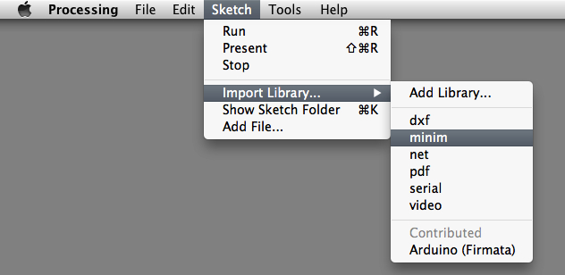
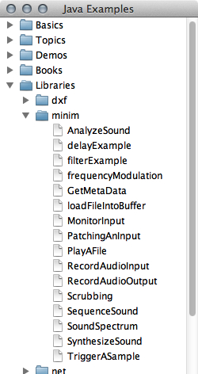

# Toucheセンサーを使う 3 - Touche for Arduinoで音を扱う

今回は、Touche (発音は「タッチー」ではなく「トゥシェ」が正しいようです) センサーの活用の3回目として、音を扱ってみたいと思います。具体的にはArduinoから送られてきた情報を、Processingを用いて音に変化していきます。

Processingで音を扱う方法は、いろいろ存在します。例えば第１クォーターのSound & Software Art WorkshopでとりあげたPure DataをProcessingからコントロールして音を出す方法などが考えられます。こうした外部とのアプリケーションとの連携をする場合には、Open Sound Control(OSC)という共通のプロトコルを使用します。

しかし、今回はあくまでProcessing単体での音響合成やサウンドファイルの再生に限定して、挑戦していきたいと思います。Processingで音を扱うためのライブラリはいくつか存在しますが、現時点で最も一般的な「Minim」というライブラリを使用して音をとり扱っていきたいと思います。

## Minimライブラリについて

MinimはJavaSound APIを利用したProcessingの外部ライブラリで、現在はProcessing本体のパッケージに最初から含まれています。Minimには音に関する様々な機能が用意されています。主な機能として下記のものが挙げられます。

* サウンドの再生 ‒ WAV, AIFF, AU, SND, MP3形式のサウンドファイルを読み込んで再生
* 録音：入力された音を、ディスクに直接、またはメモリー上のバッファーに録音可能
* オーディオ入力：モノラル、ステレオのオーディオ入力
* オーディオ出力：モノラル、ステレオでサウンドを出力
* 音響合成：シンプルな音響合成のための機能
* エフェクト：サウンドエフェクトのためのインタフェイス
* FFT：リアルタイムにスペクトル解析が可能

Minimについての詳細は下記のプロジェクトページを参照してください。

* [Minim | code.compartmental](http://code.compartmental.net/tools/minim/)

念の為、使用しているProcessingがMinimのライブラリ群が使用できる状態か確認してみましょう。Processingのメニューから「Spetch」→「Import Library…」で表示されるメニューの中に「minim」が入っていればOKです。

## Minimライブラリを使ってみる

最新版のProcessing(現時点ではv.2.0.1)には、Minimライブラリーのサンプルがいくつも収録されています。これらの内容を確認してみましょう。

 「File」→「Examples」でサンプルのウィンドウを開いて、その中にある「Library」→「minim」を表示します。

### サウンドファイルの再生と、波形の描画

ではまず、シンプルな例としてサウンドファイルを読み込んで、再生してみましょう。また、再生の際にサウンドファイルの波形を表示するようにしています。

	// Minimサンプル1:
	// サウンドファイルの再生と、波形の描画
	
	import ddf.minim.*;
	
	Minim minim;
	AudioPlayer player;
	
	void setup(){
	  size(512, 200, P3D);
	
	  // minimクラスをインスタンス化(初期化)、ファイルのデータを直接指定する必要があるので「this」を引数に指定
	  minim = new Minim(this);
	
	  // loadImageで画像ファイルを読み込む際の要領でサウンドファイルを読み込む
	  // サウンドファイルは、スケッチ内の「data」フォルダ内に入れるのが普通だが
	  // フルパスやURLで記述することも可能
	  player = minim.loadFile("marcus_kellis_theme.mp3");
	
	  // サウンドの再生
	  player.play();
	}
	
	void draw(){
	  background(0);
	  stroke(255);
	
	  // 波形を描画
	  for(int i = 0; i < player.bufferSize() - 1; i++){
	    float x1 = map( i, 0, player.bufferSize(), 0, width );
	    float x2 = map( i+1, 0, player.bufferSize(), 0, width );
	    line( x1, 50 + player.left.get(i)*50, x2, 50 + player.left.get(i+1)*50 );
	    line( x1, 150 + player.right.get(i)*50, x2, 150 + player.right.get(i+1)*50 );
	  }
	}

### 複数の音を再生

Audio Playerをたくさん用意することで複数のサウンドファイルを再生することも可能です。この例では、バスドラムとスネアの音を読み込んで、キーボードからの入力をきっかけにしてサウンドファイルを再生しています。

	// 複数のサウンドファイルを鳴らす
	
	import ddf.minim.*;
	
	Minim minim;
	AudioSample kick;
	AudioSample snare;
	
	void setup(){
	  size(512, 200, P3D);
	  minim = new Minim(this);
	
	  // バスドラムの音を読込み
	  kick = minim.loadSample( "BD.mp3", // ファイル名
	                            512      // バッファサイズ
	                            );
	
	  // ファイルが存在しない場合、エラーメッセージを返す
	  if ( kick == null ){
	   println("Didn't get kick!");
	 }
	  // スネアの音を読込み
	  snare = minim.loadSample("SD.wav", 512);
	  // ファイルが存在しない場合、エラーメッセージを返す
	  if ( snare == null ){
	    println("Didn't get snare!");
	
	  }
	}
	void draw(){
	  background(0);
	  stroke(255);
	
	  // それぞれのサウンドの波形の描画
	  for (int i = 0; i < kick.bufferSize() - 1; i++) {
	    float x1 = map(i, 0, kick.bufferSize(), 0, width);
	    float x2 = map(i+1, 0, kick.bufferSize(), 0, width);
	    line(x1, 50 - kick.mix.get(i)*50, x2, 50 - kick.mix.get(i+1)*50);
	    line(x1, 150 - snare.mix.get(i)*50, x2, 150 - snare.mix.get(i+1)*50);
	  }
	}
	
	// キー入力でサウンド再生
	void keyPressed(){
	  if ( key == 's' ){
	    snare.trigger();
	  }
	  if ( key == 'k' ){
	    kick.trigger();
	  }
	}

### 音響合成1: Sin波を合成

では次に、Sin波を生成し音として出力してみましょう。生成したSin波は、マウスの位置で音量と周波数を変更できるようにしています。

	import ddf.minim.*;
	import ddf.minim.signals.*;
	
	Minim minim;
	AudioOutput out;
	SineWave sine;
	
	void setup() {
	  size(512, 200, P3D);
	  frameRate(60);
	  smooth();
	  strokeWeight(2);
	
	  minim = new Minim(this);
	  out = minim.getLineOut();
	  sine = new SineWave(440, 1.0, out.sampleRate());
	  sine.portamento(200);
	  out.addSignal(sine);
	}
	
	void draw() {
	  //波形を表示
	  background(0);
	  stroke(255);
	  //バッファーに格納されたサンプル数だけくりかえし
	  for (int i = 0; i < out.bufferSize() - 1; i++) {
	    // それぞれのバッファーでのX座標を探す
	    float x1  =  map( i, 0, out.bufferSize(), 0, width );
	    float x2  =  map( i+1, 0, out.bufferSize(), 0, width );
	    // 次の値へ向けて線を描く
	    line( x1, 50 + out.left.get(i)*50, x2, 50 + out.left.get(i+1)*50);
	    line( x1, 150 + out.right.get(i)*50, x2, 150 + out.right.get(i+1)*50);
	  }
	}
	
	void mouseMoved() {
	  // 周波数をマウスのX座標で変化させる
	  float freq = map(mouseX, 0, width, 20, 1000);
	  sine.setFreq(freq);
	  // 音量をマウスのY座標で変化させる
	  float amp = map(mouseY, 0, height, 1, 0);
	  sine.setAmp(amp);
	}

### 音響合成2: FM合成

もう少し複雑な音響合成のサンプルを作成してみましょう。下記のプログラムはFM合成(Frequency Modulation Synthesis)による音響合成のサンプルです。

	// FM合成
	
	import ddf.minim.*;
	import ddf.minim.ugens.*;
	
	Minim minim;
	AudioOutput out;
	
	// オシレーター
	Oscil fm;
	
	void setup(){
	  size( 512, 200, P3D );
	
	  // Minimクラスのインスタンス化(初期化)
	  minim = new Minim( this );
	  // 出力先を生成
	  out   = minim.getLineOut();
	  // モジュレータ用のオシレーター
	  Oscil wave = new Oscil( 200, 0.8, Waves.SINE );
	  // キャリア用のオスレータを生成
	  fm = new Oscil( 10, 2, Waves.SINE );
	  // モジュレータの値の最小値を200Hzに
	  fm.offset.setLastValue( 200 );
	  // キャリアの周波数にモジュレータを設定( = 周波数変調)
	  fm.patch( wave.frequency );
	  // and patch wave to the output
	  wave.patch( out );
	}
	
	// 波形を描画
	void draw(){
	  background( 0 );
	  stroke( 255 );
	  for( int i = 0; i < out.bufferSize() - 1; i++ ) {
	    float x1  =  map( i, 0, out.bufferSize(), 0, width );
	    float x2  =  map( i+1, 0, out.bufferSize(), 0, width );
	    line( x1, 50 + out.left.get(i)*50, x2, 50 + out.left.get(i+1)*50);
	    line( x1, 150 + out.right.get(i)*50, x2, 150 + out.right.get(i+1)*50);
	  }  
	}
	
	// マウスの位置によってFMのパラメータを変化させる
	void mouseMoved(){
	  float modulateAmount = map( mouseY, 0, height, 500, 1 );
	  float modulateFrequency = map( mouseX, 0, width, 0.1, 100 );
	  
	  fm.frequency.setLastValue( modulateFrequency );
	  fm.amplitude.setLastValue( modulateAmount );
	}
	
## Toucheの情報をもとに、Minimで音響生成

Minim単体の機能はだいたい把握できたところで、Touche for Arduinoからの情報でMinimの音響合成をする方法について考えていきましょう。まずは、前回同様にToucheの回路をくみたてましょう。

前回使用したソフトウェアもダウンロードしておきましょう。

* [https://github.com/tado/tamabi_bmaw/blob/master/examples.zip](https://github.com/tado/tamabi_bmaw/blob/master/examples.zip)

まずはToucheの動作を確認して問題なければ、Minimとの連携に進みましょう。早速Toucheで検出した値と、Minimでの音響合成を合体させていきましょう。

今回はまず、Touche for Arduinoからの値を受けて、記録した場所からの距離を算出する部分のみを抜き出した制作テンプレートを用意しました。ここにMinimの機能を加えていきたいと思います。

#### Processing_Gprah.pde

	/*
	 * Touche for Arduino
	 * Project Template
	 *
	 */
	
	float recVoltageMax;
	float recTimeMax;
	float voltageMax; //電圧の最大値
	float timeMax; //電圧が最大値だったときの時間
	float yMax = 100; //グラフのY座標最大値
	float yMin = 0; //グラフのY座標最小値
	float graphMargin = 20; //グラフと画面の余白
	
	void setup() {
	  //画面サイズ
	  size(800, 600); 
	  //ポートを設定
	  PortSelected=0; 
	  //シリアルポートを初期化
	  SerialPortSetup();
	}
	
	void draw() {
	  background(63);
	
	  //最大値を0に初期化
	  voltageMax = timeMax = 0;
	
	  if ( DataRecieved3 ) {
	    //電圧の最大値と、そのときの時間を取得
	    for (int i = 0; i < Voltage3.length; i++) {
	      if (voltageMax < Voltage3[i]) {
	        voltageMax = Voltage3[i];
	        timeMax = Time3[i];
	      }
	    }
	    //画面に描画するために、(x, y)座標の値を画面の大きさにあわせて変換
	    float x = map(timeMax, 0, 159, 0, width);
	    float y = map(voltageMax, yMin, yMax, height, 0); 
	    float rx = map(recTimeMax, 0, 159, 0, width);
	    float ry = map(recVoltageMax, yMin, yMax, height, 0);
	    float dist = dist(x, y, rx, ry);
	
	    //現在の最大値と記録した最大値との距離を算出してテキストで表示
	    fill(255);
	    text("dist = "+dist, 20, 20);
	  }
	}
	
	//マウスをクリック
	void mouseReleased() {
	  //現在の最大値を記録
	  recVoltageMax = voltageMax;
	  recTimeMax = timeMax;
	}
	
	void stop() {
	  myPort.stop();
	  super.stop();
	}

## ToucheとMinimの融合1 - 植物テルミン

まず初めに簡単なサンプルで、連携を確認していきたいと思います。現在のToucheから送られてきている電圧の値でオシレーターの周波数を変化させて「植物テルミン」をつくってみましょう。記憶した時点でのToucheセンサーと現在との距離を、Sin波の周波数に対応させてみましょう。

	/*
	 * Touche for Arduino
	 * Touche Theremin
	 *
	 */
	
	import ddf.minim.*;
	import ddf.minim.signals.*;
	
	float recVoltageMax;
	float recTimeMax;
	float voltageMax; //電圧の最大値
	float timeMax; //電圧が最大値だったときの時間
	float yMax = 100; //グラフのY座標最大値
	float yMin = 0; //グラフのY座標最小値
	float graphMargin = 20; //グラフと画面の余白
	
	Minim minim;
	AudioOutput out;
	SineWave sine;
	
	void setup() {
	  //画面サイズ
	  size(800, 600); 
	  //ポートを設定
	  PortSelected=0; 
	  //シリアルポートを初期化
	  SerialPortSetup();
	
	  minim = new Minim(this);
	  out = minim.getLineOut();
	  sine = new SineWave(440, 1.0, out.sampleRate());
	  sine.portamento(200);
	  out.addSignal(sine);
	}
	
	void draw() {
	  background(63);
	
	  //最大値を0に初期化
	  voltageMax = timeMax = 0;
	
	  if ( DataRecieved3 ) {
	    //電圧の最大値と、そのときの時間を取得
	    for (int i = 0; i < Voltage3.length; i++) {
	      if (voltageMax < Voltage3[i]) {
	        voltageMax = Voltage3[i];
	        timeMax = Time3[i];
	      }
	    }
	    //画面に描画するために、(x, y)座標の値を画面の大きさにあわせて変換
	    float x = map(timeMax, 0, 159, 0, width);
	    float y = map(voltageMax, yMin, yMax, height, 0); 
	    float rx = map(recTimeMax, 0, 159, 0, width);
	    float ry = map(recVoltageMax, yMin, yMax, height, 0);
	    float dist = dist(x, y, rx, ry);
	
	    //現在の最大値と記録した最大値との距離を算出してテキストで表示
	    fill(255);
	    text("dist = "+dist, 20, 20);
	
	    // Sin波の周波数をセンサーの値の距離に対応させる
	    float freq = map(dist, 0, 1000, 20, 1000);
	    sine.setFreq(freq);
	  }
	
	  //波形を表示
	  background(0);
	  stroke(255);
	  //バッファーに格納されたサンプル数だけくりかえし
	  for (int i = 0; i < out.bufferSize() - 1; i++) {
	    // それぞれのバッファーでのX座標を探す
	    float x1  =  map( i, 0, out.bufferSize(), 0, width );
	    float x2  =  map( i+1, 0, out.bufferSize(), 0, width );
	    // 次の値へ向けて線を描く
	    line( x1, 50 + out.left.get(i)*50, x2, 50 + out.left.get(i+1)*50);
	    line( x1, 150 + out.right.get(i)*50, x2, 150 + out.right.get(i+1)*50);
	  }
	}
	
	//マウスをクリック
	void mouseReleased() {
	  //現在の最大値を記録
	  recVoltageMax = voltageMax;
	  recTimeMax = timeMax;
	}
	
	void stop() {
	  myPort.stop();
	  super.stop();
	}