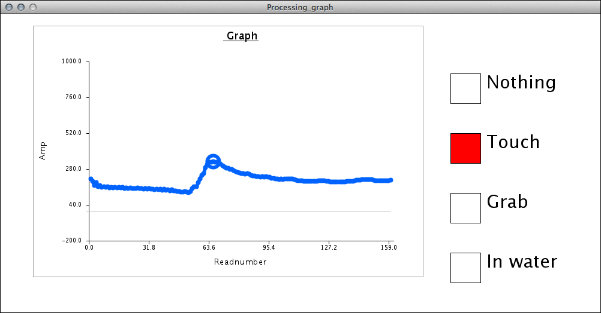
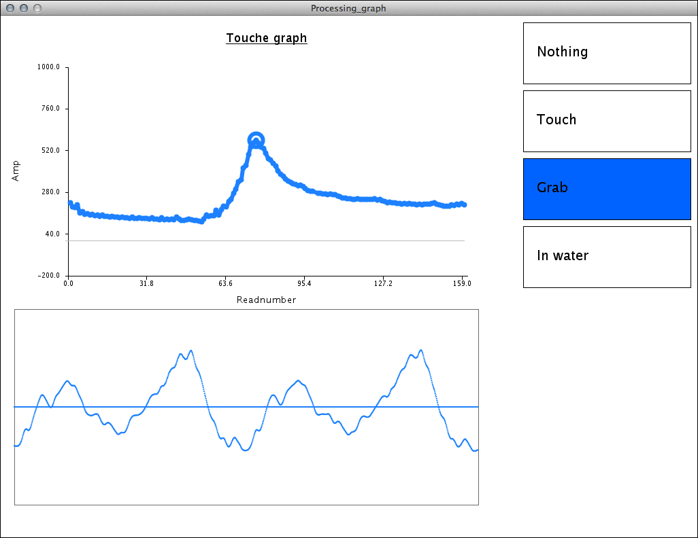

# Toucheセンサーを使う 3 - Touche for Arduinoで音を扱う2 - 複数サンプルの切り替え

今回は、前回のToucheセンサーで音を扱うという内容の補足をします。前回は、特定の時点でのセンサーの状態つまりジェスチャーと、現時点との違いをもとに、オシレーターの周波数を変化させたり、FM合成を試みてみました。

今回はさらに高度なジェスチャー検知と、サウンドファイルの再生を組合せ、特定のジェスチャーに反応して音が鳴るようにしてみたいと思います。

ここでポイントとなるのがジェスチャー認識の部分です。この部分をまっさらな状態から作ることは不可能ではないですが、なかなか大変です。そこで今回はTouche for Arduinoのサンプルプログラムを改造して、そこに音を鳴る仕組みを付加するという方法を採用してみました。

今回のサンプルの原型となったプログラムは下記からダウンロード可能です。

* [https://github.com/Illutron/AdvancedTouchSensing](https://github.com/Illutron/AdvancedTouchSensing)

このサンプルでは、4つのジェスチャーを登録して、現在のセンサーの状態との距離を算出し、それによってボタンの色を塗りわけています。

## 複数のサンプルファイルを、ジェスチャーを判別して再生

下記のプログラムが、原型となったオリジナルのプログラムにサウンド再生機能を付加したサンプルです。

MinimのAudioPlayerを配列として定義して、ジェスチャーの状態によって、消音(ミュート)と再生(unmute)を切り替えることで再生する音を変更しています。

#### Processing_graph.pde 

	import ddf.minim.*;
	
	// Minim関連
	Minim minim;
	AudioPlayer[] player = new AudioPlayer[4];
	
	Graph MyArduinoGraph = new Graph(150, 80, 500, 300, color (31, 127, 255));
	float[] gestureOne=null;
	float[] gestureTwo = null;
	float[] gestureThree = null;
	float[][] gesturePoints = new float[4][2];
	float[] gestureDist = new float[4];
	String[] names = {
	  "Nothing", "Touch", "Grab", "In water"
	};
	
	void setup() {
	  //!!!!!!!!!!!!!!!!!!!!!!!!!!
	  // ポート番号を必ず指定すること
	  //!!!!!!!!!!!!!!!!!!!!!!!!!!
	  PortSelected=1;
	
	  size(1000, 500);
	
	  //グラフ初期化
	  MyArduinoGraph.xLabel="Readnumber";
	  MyArduinoGraph.yLabel="Amp";
	  MyArduinoGraph.Title=" Graph";
	  noLoop();
	  SerialPortSetup();
	
	  //Minim初期化
	  minim = new Minim(this);
	
	  //サウンドファイル読込み
	  player[0] = minim.loadFile("anton.aif");
	  player[1] = minim.loadFile("cello-f2.aif");
	  player[2] = minim.loadFile("cherokee.aif");
	  player[3] = minim.loadFile("drumLoop.aif");
	  //それぞれのプレーヤーをループ再生しミュートしておく
	  for(int i = 0; i < player.length; i++){
	    player[i].loop();
	    player[i].mute();
	  }
	}
	
	void draw() {
	  background(255);
	
	   //グラフ描画
	   if ( DataRecieved3 ) {
	    pushMatrix();
	    pushStyle();
	    MyArduinoGraph.yMax=1000;      
	    MyArduinoGraph.yMin=-200;      
	    MyArduinoGraph.xMax=int (max(Time3));
	    MyArduinoGraph.DrawAxis();    
	    MyArduinoGraph.smoothLine(Time3, Voltage3);
	    popStyle();
	    popMatrix();
	
	    float gestureOneDiff =0;
	    float gestureTwoDiff =0;
	    float gestureThreeDiff =0;
	
	    //ジェスチャーの比較
	    float totalDist = 0;
	    int currentMax = 0;
	    float currentMaxValue = -1;
	    for (int i = 0; i < 4;i++) {
	      //  gesturePoints[i][0] = 
	      if (mousePressed && mouseX > 750 && mouseX<800 && mouseY > 100*(i+1) && mouseY < 100*(i+1) + 50) {
	        fill(255, 0, 0);
	        gesturePoints[i][0] = Time3[MyArduinoGraph.maxI];
	        gesturePoints[i][1] = Voltage3[MyArduinoGraph.maxI];
	      }
	      else {
	        fill(255, 255, 255);
	      }
	
	      //それぞれのジェスチャーからの距離を算出
	      gestureDist[i] = dist(Time3[MyArduinoGraph.maxI], Voltage3[MyArduinoGraph.maxI], gesturePoints[i][0], gesturePoints[i][1]);
	      totalDist = totalDist + gestureDist[i];
	      if (gestureDist[i] < currentMaxValue || i == 0) {
	        currentMax = i;
	        currentMaxValue =  gestureDist[i];
	      }
	    }
	    totalDist=totalDist /3;
	
	    for (int i = 0; i < 4;i++) {
	      float currentAmmount = 0;
	      currentAmmount = 1-gestureDist[i]/totalDist;
	      if (currentMax == i) {
	        fill(0, 0, 0);
	        fill(currentAmmount*255.0f, 0, 0);
	
	        //いったん全てのプレーヤーをミュート
	        for(int j = 0; j < player.length; j++){
	          player[j].mute();
	        }
	
	        //該当するプレーヤーのみミュートを解除
	        player[i].unmute();
	
	      }
	      else {
	        fill(255, 255, 255);
	      }
	
	      stroke(0, 0, 0);
	      rect(750, 100 * (i+1), 50, 50);
	      fill(0, 0, 0);
	      textSize(30);
	      text(names[i], 810, 100 * (i+1)+25);
	
	      fill(255, 0, 0);
	    }
	  }
	}
	
	void stop() {
	  myPort.stop();
	  super.stop();
	}
	
	

## サウンドの音量と画面の調整

さらにもう少し工夫してみましょう。

下記の例では、サウンドの切り替えを単純にON/OFFの切り替えではなく、ジェスチャーの距離に応じて音量(Gain)を変化させて、その一致度を表現しています。また、画面の表示も工夫して、ボタンや波形表示を改良しています。

#### Processing_graph.pde

	import ddf.minim.*;
	
	// Minim関連
	Minim minim;
	AudioPlayer[] player = new AudioPlayer[4];
	
	//Graph MyArduinoGraph = new Graph(150, 80, 500, 300, color (20, 20, 200));
	Graph MyArduinoGraph;
	float[] gestureOne=null;
	float[] gestureTwo = null;
	float[] gestureThree = null;
	float[][] gesturePoints = new float[4][2];
	float[] gestureDist = new float[4];
	String[] names = {
	  "Nothing", "Touch", "Grab", "In water"
	};
	
	void setup() {
	  //!!!!!!!!!!!!!!!!!!!!!!!!!!
	  // ポート番号を必ず指定すること
	  //!!!!!!!!!!!!!!!!!!!!!!!!!!
	  PortSelected=0;
	
	  size(1024, 768);
	  MyArduinoGraph = new Graph(int(width*0.1), int(height*0.1), int(width/3*2-width*0.1), int(height/2-height*0.1), color(#3399ff));
	
	  //グラフ初期化
	  MyArduinoGraph.xLabel="Readnumber";
	  MyArduinoGraph.yLabel="Amp";
	  MyArduinoGraph.Title="Touche graph";
	  noLoop();
	  SerialPortSetup();
	
	  //Minim初期化
	  minim = new Minim(this);
	
	  //サウンドファイル読込み
	  player[0] = minim.loadFile("drumLoop.aif");
	  player[1] = minim.loadFile("cherokee.aif");
	  player[2] = minim.loadFile("cello-f2.aif");
	  player[3] = minim.loadFile("anton.aif");
	
	  for(int i = 0; i < player.length; i++){
	    player[i].loop();
	    player[i].mute();
	  }
	}
	
	void draw() {
	  background(255);
	
	   //グラフ描画
	  
	   if ( DataRecieved3 ) {
	    pushMatrix();
	    pushStyle();
	    MyArduinoGraph.yMax=1000;      
	    MyArduinoGraph.yMin=-200;      
	    MyArduinoGraph.xMax=int (max(Time3));
	    MyArduinoGraph.DrawAxis();    
	    MyArduinoGraph.smoothLine(Time3, Voltage3);
	    popStyle();
	    popMatrix();
	
	    float gestureOneDiff =0;
	    float gestureTwoDiff =0;
	    float gestureThreeDiff =0;
	
	    //Gesture compare
	    float totalDist = 0;
	    int currentMax = 0;
	    float currentMaxValue = -1;
	    for (int i = 0; i < 4;i++) {
	      
	      if (mousePressed && mouseX > width/4*3 && mouseX<width && mouseY > 100*i && mouseY < 100*(i+1)) {
	        fill(255, 0, 0);
	        gesturePoints[i][0] = Time3[MyArduinoGraph.maxI];
	        gesturePoints[i][1] = Voltage3[MyArduinoGraph.maxI];
	      }
	      else {
	        fill(255, 255, 255);
	      }
	
	      //それぞれのジェスチャーの距離を算出
	      gestureDist[i] = dist(Time3[MyArduinoGraph.maxI], Voltage3[MyArduinoGraph.maxI], gesturePoints[i][0], gesturePoints[i][1]);
	      totalDist = totalDist + gestureDist[i];
	      if (gestureDist[i] < currentMaxValue || i == 0) {
	        currentMax = i;
	        currentMaxValue =  gestureDist[i];
	      }
	    }
	    totalDist=totalDist /3;
	
	    for (int i = 0; i < 4;i++) {
	      float currentAmmount = 0;
	      currentAmmount = 1-gestureDist[i]/totalDist;
	      
	      //全てのプレイヤーの音量を一旦下げる
	      player[i].setGain(-120);
	      
	      if (currentMax == i) {
	        fill(0, 0, 0);
	        fill(31, 127, 255, currentAmmount*255.0f);
	
	        //ジェスチャーとの距離に応じて音量(Gain)を算出
	        float val = map(currentAmmount, 0, 1, -48, 0);
	        //計算した音量を適用
	        player[i].setGain(val);
	      }
	      else {
	        fill(255, 255, 255);
	      }
	
	      stroke(0, 0, 0);
	
	      rect(width/4*3, 100* i + 10, width/4-10, 90);
	      fill(0, 0, 0);
	      textSize(20);
	      text(names[i], width/4*3+20, 100* i + 10 + 50);
	
	      fill(255, 0, 0);
	    }
	  }
	
	  //波形を表示
	  pushMatrix();
	  translate(20, height/4*3);
	  noFill();
	  stroke(127);
	  rect(0, -height/4*0.75, width/3*2, height/2 * 0.75);
	  fill(#3399ff);
	  noStroke();
	  //バッファーに格納されたサンプル数だけくりかえし
	  for (int j = 0; j < player.length; j++) {
	    for (int i = 0; i < player[j].bufferSize(); i++) {
	      // それぞれのバッファーでのX座標を探す
	      float x  =  map( i, 0, player[j].bufferSize(), 0, width/3*2 );
	      float amp = player[j].mix.get(i) * map(player[j].getGain(), -80, 0, 0, 1);
	      float y = map(amp, -1, 1, -height/4, height/4);
	      ellipse(x, y, 2, 2);
	    }
	  }
	  popMatrix();
	}
	
	void stop() {
	  myPort.stop();
	  super.stop();
	}

